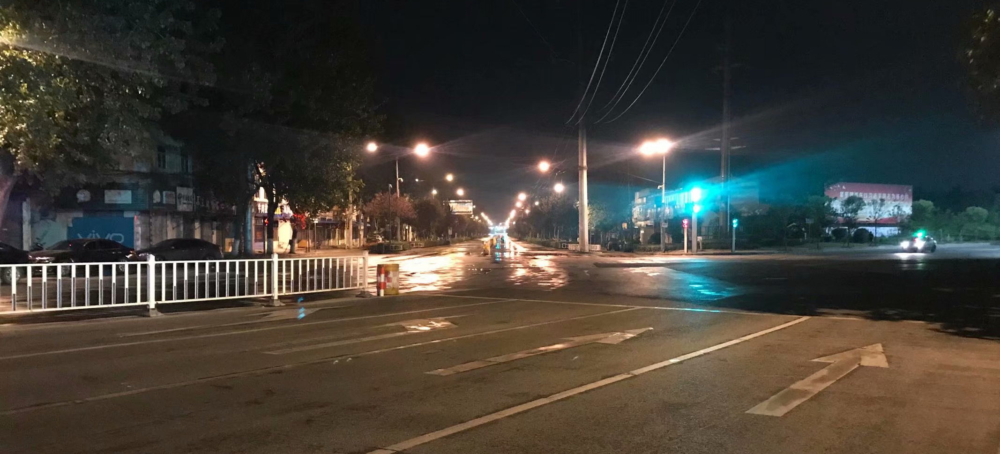

<!--  -->

2018年6月的随笔记录。

<!-- more -->

***

## 一

* 如同机械一般处理事务，如同人类一般思考和规划事务。

* 你的天王山之战。

* 一种不解决问题不罢休的精神。

* 当结果令我失望的时候，我连改变它的手段都没有。

* 总是会有更好的选择，而时间则是度量选择的最好标准。

* 最好的保护措施就是不知道，如果不知道，那么就没有办法主动做出手段干预，剩下的就交给运气。

* 世界上只有0和1。

* 年轻的时候就不应该因为年轻气盛而做出一些不可挽回的事情。

* 在你成功之前，没人会在意你的经历，就算你成功了，也还是有人不会在意。

* 人都是无知的，只不过有些人知道些什么，所以明白自己无知，而有些人什么都不知道，所以不明白自己无知。

* 我只是我自己而已，不关他人的事，我最后的抉择都是自己这个个体做出的，所以我应该为结果买单，不管是坏的，还是好的。

* 说点儿有用的，做点儿有用的。

* 是你的总是你的。

* 你曾经所做的坏事一般都不会被别人忘掉，你曾经所做过的好事一般别人也不会记得，不过也不应该就这样不继续走下去。应该的是，你自己也应该记住你所做过的坏事，然后背负着继续走下去。

* 这个时代，谁还不是个好人呢，所以你是个好人在某些方面来看不是一个重要品质。

* 不要过于勉强自己，如果太累，就在一些事情上面省下一些时间，世界上没有什么绝对必要的事情。

* 对于决定个人将来优劣的因素，我现在认为有四点：学习、见识、社交和环境。
