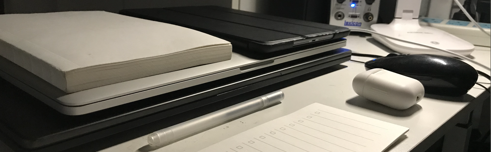
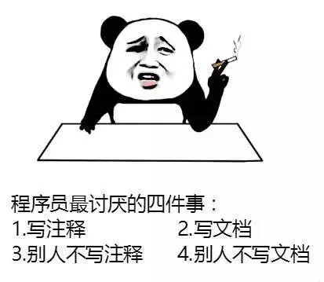
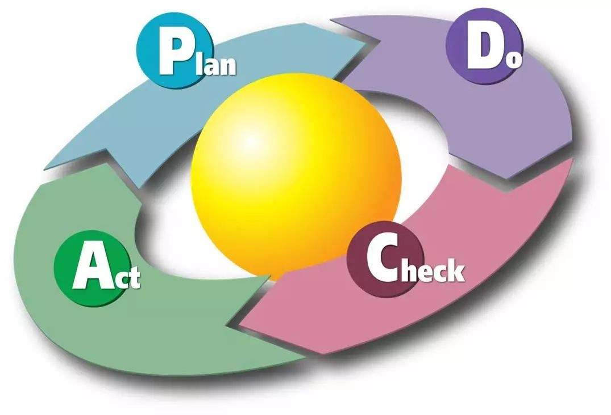
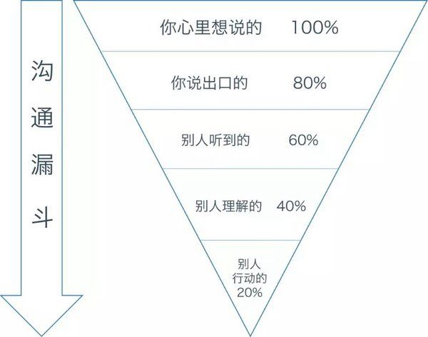
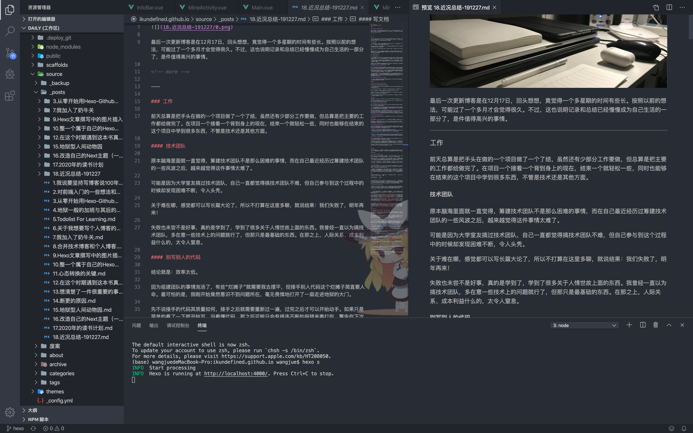
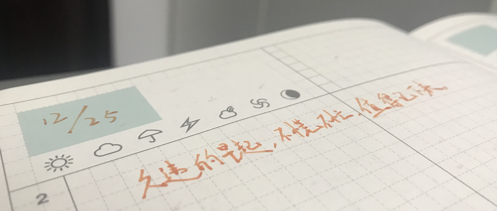
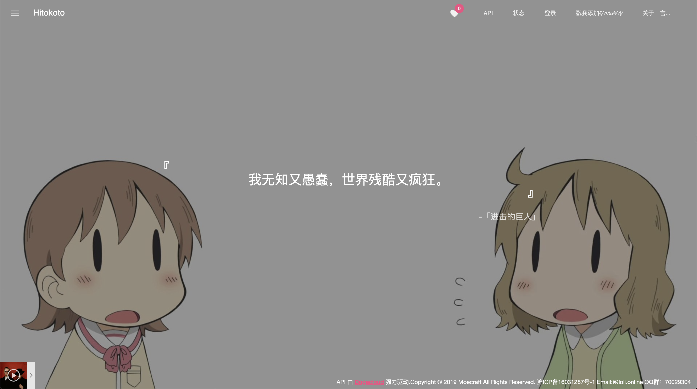

最后一次更新博客是在12月17日，回头想想，竟觉得一个多星期的时间有些长。按照以前的想法，可能过了一个多月才会觉得很久。不过，这也说明记录和总结已经慢慢成为自己生活的一部分了，是件值得高兴的事情。

<!-- more -->

---

### 工作

前天总算是把手头在做的一个项目做了一个了结，虽然还有少部分工作要做，但总算是把主要的工作都给做完了。在项目一个接着一个背到身上的现在，结束一个就轻松一些，同时也能够在结束的这个项目中学到很多东西，不管是技术还是其他方面。

#### 技术团队

原本脑海里面就一直觉得，筹建技术团队不是那么困难的事情，而在自己最近经历过筹建技术团队的一些风波之后，越来越觉得这件事情太难了。

可能是因为大学室友搞过技术团队，自己一直都觉得搞技术团队不难，但自己参与到这个过程中的时候却发现困难不断，令人头秃。

关于难在哪，感觉都可以写长篇大论了，所以不打算在这里多聊，就说结果：我们失败了，明年再来！

失败也未尝不是好事，真的是学到了，学到了很多关于人情世故上面的东西。我曾经一直以为搞技术团队，多在意一些技术上的问题就行了，但那只是最基础的东西。在那之上，人际关系、成本利益什么的，太令人窒息。

#### 别写别人的代码

结论就是：效率太低。

因为组建团队的事情泡汤了，有些“烂摊子”就需要我去摆平，但接手别人代码这个烂摊子简直要人命。最可怕的是，我刚开始竟然意识不到问题所在，毫无畏惧地打开了一扇走进地狱的大门。

先不说接手的代码其质量如何，接手之后就需要重新过一遍，过完之后才可以开始动手。如果只是简单的看了一下就开始写，没看懂代码，那之后可能只会有接连不断的报错来毒打你，警告你下次看清楚了再改代码。

那重新看一遍难道不需要花时间吗？更窒息的是，要看没有注释的代码那真是要命。假如这个项目很大，文件的关联很复杂，那直接送我上天吧（悲。

这些都是不考虑代码质量的事情。假如这个代码写得很烂，那就更完蛋了：命名不规范，组件粒度太粗，代码复用率太高等种种问题。说实话，要接着这些代码写下去，不如让我重新写。

但代码质量高就好了么，其实会好一些（真香，但问题依然不会改变。你需要读代码，如果代码水平太高，且没有注释的话，你可能很难理解为什么那里要那么做。为了统一规范，你需要改变自己习惯的方式，去了解，去模仿，这个过程也需要花时间。

那是不是接手跟自己水平相当的人的代码就好了？也不是，命名符合规范的情况下，也有很多种规范，你可以确定你们是一个体系中的么，更何况不止有命名规范需要统一。话又说回来，你觉得碰到跟你技术相当的开发者的机会会很多么？怪不得技术团队在最开始需要让新人熟悉一下开发文档，学到了，学的深刻。

总而言之，为了项目的效率，不要写别人的代码。但话又说回来，如果没有这个需求，谁又会愿意去写别人的代码呢？真是令人头大。

#### 闭环

闭环不仅仅对工作重要，对人的发展也重要。

一件事情，要不然听到了马上做，要不然就记下来以后找时间去做，做了以后如果没有完成就要有意识但去叮嘱进度。

没什么好说的，善始善终，有开始就要有结束，这个道理说100遍也没有做1遍有用。

这个我们得向电脑学习，跟人学不靠谱，因为靠谱的人太少，周围难找到。

以上说的都是一个人做事所要做到闭环应该做到的部分，而多人协同合作中，影响闭环的最重要因素除了执行力之外，应该就是沟通效率了。

大多数协同合作的工作并不是仅仅只做好自己的事情就好了，而是需要你关注他人的进度，因为这些事情可能影响你的工作进程。

#### 效率

提高效率真是工作上的一个硬话题，逃也逃不掉，是块难啃的骨头，但不啃又不行。

影响整体工作效率的关键指标是闭环，而现在的工作大多都是协同开发，那闭环中的沟通就很重要，所以提升沟通效率即可提升工作效率。

但抛开刚才已经提过的闭环，闭环内部的工作主要还是由自己来完成，在这之中还有很多可以提升的部分，而这些正是我不足的地方。

总是把事情拖到最后才做，有正事的时候划水做别的事情，这两点是最影响我个人效率的事情。我本身开发速度不算慢，但每次都拖到项目快到一个节点的时候才打起精神好好做，这让我每次开发都像坐过山车一样，虽然结果都是有惊无险。

但正是因为这种有惊无险，加深了我脑袋里面“就算项目晚点开发也没事，总会有办法的（Gonna be ok）”。昨晚正好看了[谨慎勇者](https://www.bilibili.com/bangumi/media/md28222736/)第十一话，谁知道我会不会哪次因为这种Gonna be ok的想法，让自己断送职业生涯呢。这让我有了一种观点：生活下去要Gonna be ok，做好工作要Ready perfectly。

其实刚才说到的两点问题，只要做好一件事就可以了，也就是：马上开始做手头上有的工作！

#### 写文档

现在我写文档一直用的都是markdown，所以用什么编辑器写，就成了一直纠结我的一个烦恼。

换了mbp将近一个月左右了，因为[Yosoro](https://github.com/IceEnd/Yosoro)这个markdown编辑器用的不是特别顺心，所以又找了找别的markdown编辑器，结果让我找到了[typora](https://www.typora.io/)。

yosoro让我不满意的地方只有一点，不能跟电脑上的文件夹同步（可能是我没找到方法。因此，我每次都是在yosoro上写好md文档，然后导出，放到该放的位置。但是这样，一旦遇到更新，难道要在yosoro里面编辑后再导出覆盖？太不爽了。

所以我现在一般都是先用yosoro写文档，导出之后，用[vsc](https://code.visualstudio.com/)来继续更新内容。vsc现在的版本预览md的感觉还是很爽的，只不过写起来没有那么愉快，但vsc有各种插件，我没有捯饬过，所以不太清楚。

前两天驻场办公，想要在电脑文件里面做个存todolist的markdown文档文件夹，为了能够找到一个比vsc更好一点，专门用来读写本地文件夹的markdown编辑器的时候，我遇到了typora。

typora让我最满意的地方就是她弥补了yosoro的缺陷，能够读写本地文件夹，同时又能够保证阅读和书写的体验，这点对于现在的我来说非常重要。

说到这里，我虽然减少了用什么编辑器写markdown的问题，但又多了一个，到底要不要删掉yosoro的烦恼。因为yosoro里面存了不少我之前写的md文档，我懒得转移，暂时不打算删掉。不过，一台电脑上装那么多markdown编辑器让我听纠结的，虽然现在他们哪个都不多余。

这个问题我暂时不打算多想，毕竟都是工具，先用着，等过一段时间，有了具体的体验之后再做决定。搞不好哪天又出来个更好的markdown编辑器也说不定。

---

### 生活

这段时间的生活只能用一个词来形容，平稳。没有什么特别的大事发生，但生活依然在平稳的前进，仿佛一切重要的事情都如假象一般，可能是自己已经慢慢学会接受在痛苦中平静了吧。

#### 记手帐

12月初，为了在给喜欢的人的生日礼物里面写一封信，我找朋友咨询了一下钢笔和墨水的相关问题。在那之后买了一支钢笔，然后认真的写了一封信，连同礼物一起寄给了她。

就因为这个事情，我开始用这只新买的钢笔和尘封了好久的老手帐本，开始重新记起了手帐。想了一想以前记手帐一直不能长久记下去的原因，联想到了写博客也无法坚持下去的原因。但看看现在，博客已经能够写下去了，我已经找到了突破口：停止自己的”完美主义“。

真是看起来简单，做起来难上加难的话。从出生到现在一直都存在于身上的毛病，怎么可能一下就改掉呢，但反过来想想，不去改，那永远也改不掉。这让我想到了最近听说的一句话：

> 做，50%；不做，0。

实际上，坚持下来写博客也算是打破自己完美主义心态的一种尝试。至少不是“[说要坚持写博客说100年](https://ikundefined.github.io/2019/02/28/1.我说要坚持写博客说100年了/)”了，而是“坚持写博客1年”了，可喜可贺。

开始记手帐也算是资源的重新利用吧，之前朋友送给我的一些贴纸，还有以前买的很多胶带，总算可以重新用上了。但最重要的是，记手帐的这种总结方式，真的很好，我原本觉得只要把自己的想法全部都写在博客里面就好了，不过，结果却不是这样。总是有些东西不能浮上台面，但我现在也没有什么可以直接对话的对象。在手帐里面释放，就成了一种独一无二却恰如其分的方式。

#### 一言

说到手帐，就不得不提一下一言。这里说的一言，可以指三个内容：[一言网站](https://hitokoto.cn/)、一言app、一言历。

我最早接触到的是一言网站。

在bangumi的右下角一直有一个bangumi看板娘，这只看板娘总是在说着一些“名台词”，有些很有意思，有些意味深长。我很好奇这些话是从哪里来的，但我从来没仔细思考过。直到有一天，我从一个个人博客的网站链接中找到了一言这个网站，我突然明白了，还有这样一个收集各种各样短语的网站，这太戳我了，要知道，我可是曾经没事就拿出手机发说说的男人啊。

在那之后，我顺藤摸瓜，竟然找到了一个叫做一言的手机app，虽然这个手机APP跟那个一言网站没有什么实质性的关联。进入到app store，我发现这个app需要花1块钱购买，我毫不犹豫地点击了支付，并下载了这个应用。结果告诉我，这是值得的，这个软件我很喜欢。

一言中可以看到别人发的“一言”，也可以看到一些著名的“一言”，自己也可以发布自己的“一言”，最主要的是，她的界面做的非常的文青，有一种稳重、低调的感觉，瞬间就让我有了一种自己是文艺青年的错觉。

我一直都相信话语和文字是有力量的。说出来的话能够实现，是因为有言灵的存在。这种说法很有意境，只可惜我的言灵可能是被我气死了，所以我现在说出来的话基本都是flag。而文字也是存在力量的，这正是一言带给我的感受。一句话里面的力量可以让人在看过之后心情大变，可能是早晨读完一句话之后精神满满的一整天，也可能是深夜空间某人的一句话换来的彻夜难眠。

也正是因为相信文字是存在力量的，我买了一言历，一言出品的2020年日历，每天都赋予了一句话。我觉得很有意思，每天的一句话，引导着一天的方向，给我一种塔罗牌的感觉：给自己施加心理暗示，做更好的自己。所以我毫不犹豫的买了下来，当我看到实物的时候，我觉得挺值的。

那这些跟手帐有什么关系呢？我是打算明年开始，每天结束的时候把当天的那张撕下来，贴到自己的手帐上，记录下那天想要记录的内容。但这些都是相辅相成的巧合：碰上了她的生日；买了新的钢笔；写了一封信；找出了从友人那收来的手帐；一言发布了一言历；看到了一篇[情感博文](https://covermusic.cn/hui-about-lost-people)；想起了“星座学”；打算学习塔罗牌。

#### 塔罗牌

作为“科学信仰者”，我竟然会有学习塔罗牌的打算？

我并不认为塔罗牌不科学，但也不盲信塔罗牌可以决定未来。我认为塔罗牌是一种帮助自己调整心态的一种工具，为自己提供心理暗示。这也就是我打算买一言历的理由：文字是存在力量的，为我提供心理暗示，让我变得更好。

我并不相信星座，但我也因为喜欢的人说过星座的话题所以去了解过。也因此，我遇到了塔罗牌。《[JOJO的奇妙冒险：星尘斗士](https://www.bilibili.com/bangumi/media/md28223481)》中，前半段旅途的替身都是以塔罗牌来命名的，这让我对塔罗牌更有了些兴趣，淘宝了一下竟然发现有实体卡牌卖，这不是明摆着让我入坑嘛。

对于塔罗牌的兴趣说明了，我逐渐地在脱离那个束缚我的刻板认知，脱离那个自以为是的自我意识。放在一年多以前，我都不会愿意为了喜欢的人了解她关注的事物，更不会相信“占卜”里所蕴含的力量，因为我只盲目地相信我自己，没有什么会比我和我相信的一切要正确。

#### 年终总结

前段时间写了一下[2020年的读书计划](https://ikundefined.github.io/2019/12/15/17.2020年的读书计划/)，顺便做了一下2019年的读书总结，实际上就是为年终总结开个头。

一年到头该总结的东西太多了，但想着要把每个东西都给写的尽量的详细，就感觉变成了无比庞大的任务，最后就不了了之。

这次应该也会写很多东西，但尽量的挑重点去写，毕竟我自己做博客是为了给自己看，给自己总结，没必要把一些需要改进的事情藏着掖着。

只希望这次能够把年终总结写出来，至于时间，不要太迟就好。

#### 第一个圣诞礼物

圣诞节前几天，我的WOTA艺团队Team·Camelot的leader冰连凋把大家召集到一起录制了圣诞节送给大家的庆贺视频《[Snow Halation](https://www.bilibili.com/video/av80301286)》。

在那天吃晚饭的时候送给了我们每个成员一件衣服，这是我第一次收到的圣诞礼物，感谢亚瑟王！

---

原本自己心里一直很忌讳写近况总结，因为自己觉得不管是技术上还是个人生活上，写近况总结不如对一些有感触的特定内容进行详尽的总结。

但这终究还是自己把自己局限在了一个框框里，自己的博客总是把内容的分门别类作为重点，却忽视了写点什么才是最重要的事情。

也就是捡了芝麻丢了西瓜这样的事情，道理放在口头上总是朗朗上口，实际执行的时候别说做的完美不完美了，可能连第一步都难以踏出去，就是因为被自己思想上那无形的墙给阻隔了。

但还好，打破桎梏后的现在，我也愿意写近况总结了。
