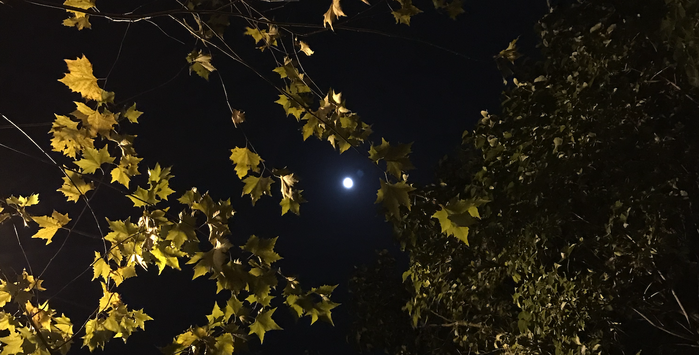
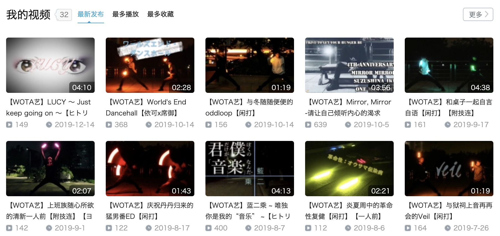
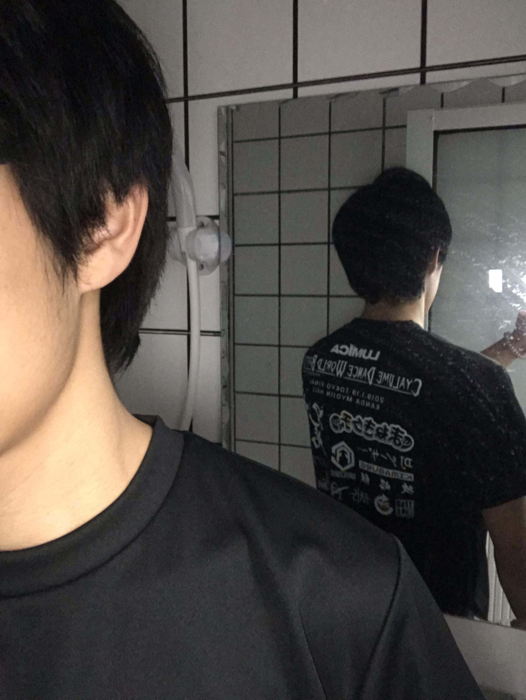
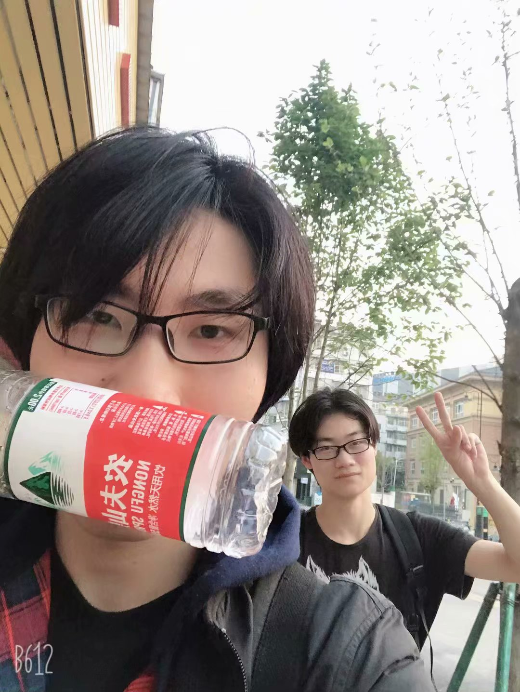
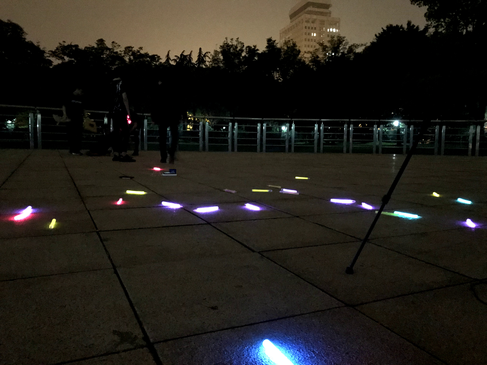
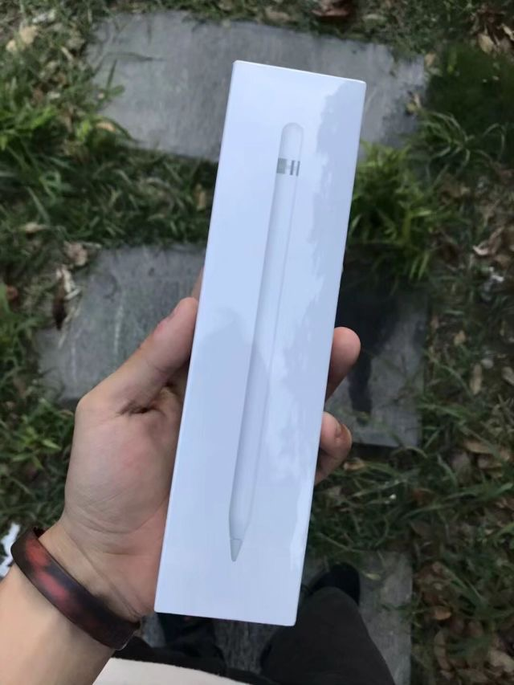

一口气想要把一年给总结完，结果越写越长。初稿从12月中旬就开始写，写着写着发现要总结的东西越来越多。时间从十二月中旬拖到一月中下旬，最后心想：算了，把之前列的和草稿上有的，以及无论如何也想写进来的东西给写下来就好了。

<!-- more -->

---

可能是因为工作之后没有学期长假的分割，还没有适应法定节假日这样的时间节点，一年之中的时间概念因此模糊了起来。回头一看，发生的事情真的很多，明明只是进入社会之后的第一年而已。

为了明确思路，整体从六个方面写，分别是**生活**、**社交**、**爱好**、**感情**、**经济**和**工作**。

## 生活

汉字词语真是好用，脑子里面想着怎么样才能方方面面的概括好生活这方面的情况，结果一想到“衣食住行”这个词就完全解开了我的迷惑。从我的生活角度，按重要程度来排序的话，应该就是[住](https://ikundefined.github.io/2020/01/02/19.2019小作文/#住)[行](https://ikundefined.github.io/2020/01/02/19.2019小作文/#行)[食](https://ikundefined.github.io/2020/01/02/19.2019小作文/#食)[衣](https://ikundefined.github.io/2020/01/02/19.2019小作文/#衣)了。

### 住

在19年到来之前，我就已经在上海生活了将近半年左右的时间。这是第一次一个人生活，但我倒没有多不适应。有时候在自己经历了很多事情之后，再遇到一些第一次的情况，就不会像是第一次一样那么不适应，反而像是理所当然，脑子里面觉得这就是应该的。

从集体宿舍搬出来一个人住是因为工作，搬到现在住的地方是因为离公司近，除此之外，并没有考虑很多。事后其实有些后悔，因为房租相对于我现阶段的工资和房间本身的大小来说，确实是有些不理想。就在这个月月初，我还在琢磨着搬家的事情，但想到明年3月之后，[贷款](https://ikundefined.github.io/2020/01/02/19.2019小作文/#机构欠款)都能还的差不多，并且[工资](https://ikundefined.github.io/2020/01/02/19.2019小作文/#在职公司)大概也会有所提升，所以我暂时打消了搬走的想法。

这个房间很小，但五脏俱全——既有独卫也有“开放式厨房”。虽然这一切都集成在这些小小的几平方米之中，不过对我来说，已经是满足基本需求，毕竟除了睡觉和休假之外，基本也都是在外面呆着。

话说回来，一个人生活果然能够暴露出很多自己的问题，于我而言，最典型的缺点就是懒。稍稍偷懒，房间就会乱的不成样子。像我住的这种小房间，一进去就能看到床，床很乱，那打开门后的心情也会变得一团糟。因此，**东西的收纳需要时常注意**。我本来就有一点积物习惯，一不小心就容易让这小小的生活空间充满一些“无用”的东西。东西不怕放在那里，就怕一直不用，既花了钱买，又占了空间资源。也不难想象当初母亲为什么会说出*我自己一个人过不好日子*这样的话了。

整理东西对我来说是次要问题，毕竟我不是那种一年到头都不整理东西的人，只要东西足够乱就能够让我攒足动力去整理。基本上不超过两个星期，我就会好好的整理一遍可见范围内的事物，但卫生就不是这样了。到现在为止，最影响我的就是卫生情况了，我买回来的扫帚和拖把除了在刚买回来的那个月用过之外，就再也没有拿出来过了，这正是我重点需要改进的问题。**正值年末，可以考虑好好大扫除一番了**。我之前还有想过**在家里打赤脚**呢，是时候该实现这个美好的愿景了。

为了完整的清理好房间，还得去**买一个马桶刷**。9月左右马桶坏掉不能自动冲水之后就很少在家里上厕所了，但卫生间一直脏兮兮的不去清理，继续拖下去也没用，毕竟我已经不打算搬走了，那么对我来说整一个比较干净的环境还是很重要的。除了马桶刷之外，还有**地板垫**、**冬天穿的拖鞋**和**空气清新剂**要买。

既然打算长期住下去，除了卫生环境以外，我还想好好地装饰一下房间，原本不打算久住，房间都没怎么装饰。前两天贴了几张以前留下来的海报，瞬间感觉有生活感多了。以后打算留意留意好看的**海报**还有**装饰物**，好好地改造一下自己的房间。关于之前一直纠结的房间大小，我是这样想的：**关于在有限的空间里如何分配资源永远是一个课题，对于房间是这样，对于别的事情，也是这样**。

### 行

行跟住有很大的联系，如果家就在地铁站旁边，也许会让我对于**出“远门”探索**这件事情更加的上心。但实际情况并不是这样，除了打艺、驻场办公以及和朋友一起出去玩之外，好像很少有自己主动想要出“远门”走一走的情况。相反，如果只是家附近的话，我倒是已经熟的不能再熟了。

我一直有**坐地铁把上海有趣的地方都给去个遍**的想法，但理想总是~~美好的~~需要付出行动的，除了行动，还有钱。

<!-- todo 填链接 -->

我还想**买自行车**，但住的地方不好放，硬要买的话，也许折叠式会比较合适。不过怎么想也没有明年会买的感觉，毕竟[下一份工作]()还不确定。如果还是在这个公司做，且经济情况良好，那整一辆或许不错，毕竟出门的时候会方便很多。

### 食

今年在吃上没什么讲究，除了外卖、方便面就是零食，就只有偶尔和朋友一起出去才会吃一些“正式”的食物。这些食物好不好吃还是另外一回事，不过大多数是真的消费不起。这也导致我现在比较抗拒出门吃东西，目的之一就是为了省钱。

当初租了能做饭的房子，结果一年到头却从来没有下过厨房，除了烧开水泡面。如果今年经济状况有回转，会考虑**买一些餐具厨具**，自给自足。说起来我还没有过独自一人买菜做饭的经验，想到这里还有一点小激动。**像自己做饭什么的，也是很早之前就偶尔又在脑补的事情了，希望明年能够有机会切实尝试**。

之前在驻场办公的时候，看到别的公司的职员吃着自己带来的水果，心想自己在营养补充方面也有很大的问题，明年应该**逼着自己让自己多吃点水果**，毕竟我本身也不讨厌吃水果。而且，**我喜欢的人也非常爱吃水果**。

说到水果就让我不得不想到白开水。明明今年生日的时候从打艺的后辈那里收到了之前转发的说说里说到的水杯，结果拿到手之后也就用了一段时间，如今已经很少用了。不管是为了省钱，还是为了身体健康，又或者是为了利用好从后辈那里收到的生日礼物，明年也应该**多喝白开水**。

<!-- 水杯图 -->

<!-- 说说图 -->

### 衣

穿着打扮我真的是没品位，而且经济上也很有困难，虽然想要买好看的衣服和鞋子，但实在拿不出在这上面的钱。前些日子，Team·camelot的leader帮我看了一件衣服，我也很喜欢，但那个价钱我实在没办法一下子拿出手，只能眼睁睁的错过。

<!-- 看上的衣服 -->

鞋也是，更早之前跟朋友在南京东路的阿迪的专卖店里看到了一双自己很喜欢的鞋，但也是因为买不起而错过。虽然说朋友说了可以帮我出点钱，但**我对欠人情这样的事情比以往多了一些心眼。最主要的是，不想被这样的心情束缚自己**，最后还是拒绝了。

<!-- 看上的鞋 -->

虽说我想要买新衣新鞋，但除了鞋不够穿以外，我的衣裤还是够穿的。只是从别人的角度来看，有的衣服比较呆，但我现在也不是有钱争这个的时候，睁一只眼闭一只眼吧。

说起来，有的衣服因为很喜欢，所以经常穿，穿到不得不洗为止。但总有那种洗了之后需要马上穿这件衣服的情况，为此，我很想**买烘干机**。在这上面犹豫不决的原因除了缺钱以外，就是刚才提到的房间大小了。综合这些考虑，明年会看看有没有那种大小适合，自己也能够买得起的烘干机。

<!-- 喜欢的衣服 -->

像这种提升幸福感的电器多起来，对于生活也是一种鼓励吧。

## 社交

<!-- 整理 ing -->

在进入社会，与各式各类的人打交道之后，对一些事情的认识也越来越深。我很幸运，即使在陌生的城市也有着不少朋友——因为打艺认识的打师、培训班的同期还有大学毕业以后被我邀请进入同一公司的大学室友等等。但即便如此，我也认识到，**学会享受孤独也是一件很重要的事情**，在这里就不做话题展开了。

### 艺友

打艺是我来上海的根本原因，虽然从前就向往这个城市，但是，如果没有wota艺的助推，我可能很大概率不会来到这个城市发展。而现在联系的大多数朋友，都是上海的wota艺打师，从社交需求的这个层面来说，多亏了他们，我才能够继续坚持下去，不管是打艺还是生活。

上海的打师朋友中完全不缺少优秀的人，这也是我觉得非常重要，非常难得的事情。我在这一年中的很多成长都是受到了他们的影响——如果不是这个圈子，我可能很少能够接触到这样优秀的朋友，如果不是他们，我可能过很久在能得到这么大的成长。

不过可能是他们过于优秀，我太过自卑，又或者是情绪的起伏变化太频繁，导致时常会感受到异常的压力。我不擅长玩梗，也不会说话，所以有些时候无法融入进他们，我不确定，到底问题出在哪里，但这是我一直都想要解决的问题，希望明年可以改善这个问题。

除了上海的打师朋友以外，通过wota艺认识的全国各地的打师对我也有各种不同的影响。今年下半年我还整了一个自己的亲友群，其中基本都是关系不错的wota艺打师。在这个群里，我可以说自己想说的话，也不用担心自己太过ky。只不过我有一个很恶心的毛病，那就是动不动退群，太不成熟，太不理智，不改不行。

### 同事

工作之后面对时间最多的人就是同事了，在这方面，我认为交往中的分寸是比较难掌握的。

我这个人大概就是不熟悉的时候很难接近，熟悉了之后就会放下戒备，但同时自己也会放肆起来。说简单一点，就是不懂的分寸，经常容易说错话，KY。之前在跟领导出去吃饭的时候，我就被大学室友说过我跟领导说出来的话太不合适了，没有分寸。

就如何做到待人分寸得当，是一个长久的话题。这一点并不仅仅只是对同事这样，对其他人也是这个道理。在与同事的相处上提出这一点的原因只是因为，同事是我接触时间最长的对象而已。

实际上之前就也有过对打师前辈说话分寸不当而得到恶劣评价的情况，这点不可否认，是自己做的不够好。

### 亲友

说到人际交往间的问题，物理距离绝对能算是一个“杀手”级的存在。特别是对于曾经关系好，但现在，因为地理位置的原因，逐渐疏远的朋友。我觉得很少有人能把握好分寸，而我就是那大多数把握不好分寸中的一者。

一般来说，人不能见面，最后一般都只能在网络上保持联系了，而我最不擅长的就是在网络上经常地保持联系。可能有时候非常孤独，就会在网上寻求人与人之间的依赖感，有时候非常繁忙，可能连现实中的人际交往也给忽视。但无一不能够体现出，我是一个无比自私的人。

我想到和前女友交往的时候，只有她来找我，很少有我找她的情况。再来，我基本昼伏夜出，跟她的时间完全相悖，只有打艺的时候能够见面，而打艺的时候，我却很少正眼看她，甚至还说她这说她那。

当我意识到问题的时候已经太晚太晚，但总归是意识到问题，也在改进了，真是难怪会有这样的话：

> 一生中要遇见很多人，有的人，遇见的不是时候，就是注定要错过。

认清了自己傲慢的现在，我也不会不主动去联系别人了，有的时候想到了某些曾经关系还比较好的朋友，就会主动去找他，但常常会想，是不是他会觉得我有求于他才会找他呢？难怪了，连我自己都这么觉得，我以前到底有多目中无人啊。

### 网友

对于我来说，列表里的网友，基本都是人生中的看客，我们互不强烈影响，但彼此静静地躺在各自的列表中。我不会打扰他们，也不会对他们说的一些内容提出意见，只是默默的看着。如果他们对我有一些强烈的影响，那么我也会试图走进他们的生活（褒义。

而不管如何，在现在这个时代，也许他们对我来说并没有那么大的影响力，但也是我生活中不可缺少的一部分。用什么样的态度和心态对待这些网友，我觉得也算是一个课题，毕竟面对他们也是面对自己的一部分。

### 家人

我对于家人的态度是冷漠的，可能只是我不擅长表现自己的心情。特别是工作开始以后，我除了过年这样的长假以外基本就没怎么回过家。

我小时候一直觉得家人是一种负担，家里的很多事情，我都不想正视。所以，自从在住宿制的学校上学以来，我基本上就不怎么会想家，该回去就回去，能不回去那就不回去。这种情况从大学以来越来越明显，直到现在工作，终于，今年内大概回去过的次数用一只手也能数得过来了吧。

其实限制我回家次数的主要因素，主要还是工资不够，其次自己也不省钱。平时虽然跟家里人说钱够花了，但往往总会因为一些意外，导致每个月总是差钱花。

不过还好，今年我不打算再这样下去了。除了打算好好地处理一下经济上的问题，让自己可以经常回家以外，我自己的心态已经稍微发生了一些变化。我现在偶尔心里也在想，假如有机会，也跟父母多说说自己的兴趣爱好，多聊聊自己的事情。特别像是我的奶奶，年纪已经很大了，再不去关心，也许就没有关心她的机会了。

之前在《[【Aha视频】北京深夜的漆黑角落，是中年男人仅剩的一点乐趣
](https://www.bilibili.com/video/av71395664)》中，看到了这样一段话，对我很有感触：

> 他养你小，从这么大给你养一百多斤，你不该养他老吗，好意思你说孝吗，我说不出来。

家里对外都说一些关于我的一些骄傲的话，我自己也知道，所以更加成为了自己的负担。也为了不让家里担心，我总是不说出来自己的这种压力。但这种负担从另外一种角度来说，也是造就现在的我的一种动力源。

这些问题在新的一年，我也会去解决。特别是经济问题，基本上解决了这个问题，我的大多数痛苦都可以得到缓解，甚至根除。

## 爱好

今年算是有好好地在做自己喜欢的事情，不过从10月底开始，加班越来越多，也越来越把放在一些重要兴趣爱好的精力给分散开来了。工作和爱好上的比重是现在比较困扰我的问题，在此之上，又想发展更多的爱好，值得好好地想想接下来的路。

### wota艺

今年除去之前删掉的视频，一共做了20个作品。除去“认真”做的3个一人前企划之外，分别做了9个双人、4个三人、2个一人前和2个五人番队。

不说作品，这一年也发生了很多对我影响很大，并且值得记录的事情，借着年终总结的机会总算可以好好的理一理了。

#### 第一届CDWB决赛

今年1月份，在东京举办了第一届CDWB总决赛。我没能够直接的参与到这一届的总决赛之中，但是从去东京参加了表演的嗷君那里听到了很多关于日本打师那边的事情，这让我情绪高昂。除此之外，嗷君还买了两件CDWB的周边T恤，我从他那里买了一件。

约嗷君出来吃了一顿饭，之后去上音录了[Bad for me](https://www.bilibili.com/video/av41257994)，从现在的角度来看，那个时候打的也太不行了，但也很感谢嗷君喊我打了这个视频。

#### 同济赏樱

因为3月末，同济的樱花开了，大家都去了同济打艺。我在这之前，只去过一次同济，那段时间我带着点好奇也跟了过去。3月底去了两次，第一次樱花零零散散的开了一些，但说不上壮观，心里也有一点失望，觉得“原来也就这种程度啊”，但隔了一周去，樱花满开，非常好看！从那个时候心里就在想，要是能和喜欢的她一起看就好了。

<!-- 视频 -->

在去同济打艺期间，和沙包前辈录了一个[双人](https://www.bilibili.com/video/av47048813)，也是第一次和沙包前辈录双人艺，希望以后还能再录。

#### 第一次通宵艺

清明节期间，回去了芜湖一趟，找了在本地上学的打师雾离一起打艺，意外的是，一约就是一夜。这也是我第一次彻夜打艺，是很快乐的回忆。

当天晚上原本只是准备喊在芜湖的打师录个五人企划，没想到凑不齐打满整首歌的五人番队，所以就[凑合着随便录制了一下](https://www.bilibili.com/video/av48664047)。之后和雾离去滨江录了[技连](https://www.bilibili.com/video/av48760871)，以为会很快结束，结果从11点多录制到了3点多。想着，反正都这个时间了，吃点东西再说吧，然后去了滨江附近的一家24小时便利店整了点东西吃。吃完之后灵感泵现，紧接着录制了[oddloop](https://www.bilibili.com/video/av48725416)，一下子就录到了天亮，直到回家的路上为止都无比精神。

现在，雾离已经没怎么活跃了，不知道以后还会不会坚持，能坚持多久。在工作和爱好中做取舍真的是有难度的事情，希望他能坚持把喜欢的事情继续做下去，对我来说也是。

#### 7th trigger

蛋壳在五一劳动节的前两天喊了七名打师出来录制了[7th trigger](https://www.bilibili.com/video/av53612062)的这个企划，其中就包含我，这也是我第一次完整的参与进一个正式的企划。

参与这个作品前，我在骑自行车去打艺的路上摔了一跤，因为下雨和下坡速度很快的原因，在自行车转弯的时候狠狠的滑倒了。惊险的是，我滑倒在路马路中央，幸运的是，没有车撞到我。下次雨天过后骑车还是要小心，这次只是运气好，没有出什么致命意外，搞不好下次就没有下次了。这里就不上伤口的图了，毕竟可能会有点恶心。不过虽说是受伤了，我还是完整地打完了自己参与的部分。受伤的程度并不是特别轻，我能够打完其实自己也有一些意外。

在这个作品录制结束之后，蛋壳向我们要署名信息，大家都是用的英文，这里我也想统一一下，但用ike的话总感觉有些普通。之前正好用了铃科依可子作为QQ名称，这让我想到了Suzushina_IkE这个称呼。Suzushina是铃科的罗马字写法，IkE则是我之前就有想过的一种ike的“装逼”写法，中间用空格连起来的话有的软件不支持这样的名称，所以干脆就用了下划线作为连字符。现在，我的B站昵称和QQ昵称都已经改用这个称呼大半年了。

蛋壳能够选上我参与这个作品，我真的是觉得非常荣幸。他观察到我的自卑情结，对我说过不要那么自卑，我嘴上说听进去了，心里也这么认为，但总是在行动上做不到一致，克服这样的心理也是我需要面对的主要问题。其实能够邀请我参与，也算是对我有一定的认可吧。年末对wota艺渐渐开始有些偷懒，看着自己现在的这幅德性，我自己也有些对自己失望了。一做到什么，就开始得意忘形，开始懈怠，这个毛病真的得改。

#### 参与BML演出

当时刚参与完BML的表演，是打算做一篇完整的记录的，结果一拖再拖，最后还是放到年终总结里面了。这么一看，年终总结这么臃肿的原因也得到了解释。

小可在6月的时候找到我，说邀请我一起参加BML，我有些吃惊，虽然很高兴，但第一反应是——真的吗？因为这对于我来说实在是太过于惊喜了，惊大于喜，曾经梦想的舞台，没想到能够以这种形式参与。在知道这个消息的瞬间，我恨不得让世界上所有的人都知道这件事情，知道我自己的心情，但即使如此，我还是抑制住了这种张扬感。要是以前，肯定就已经在空间说个不停了。

不过，激动归激动，激动之后，留下的紧张也不是一般的。毕竟，我是作为特殊成员和攻略组一起参加表演，攻略组可是我一直以来向往的组织啊，而且他们都是当时我眼中非常厉害的人。面对这样的压力，自己也非常担心把搞砸了。抱着这样激动却又忐忑的心情，我和攻略组的成员们一起开始了集训排练。

刚开始的排练对于我来说不太顺利——记错动作，在检查动作的时候紧张的忘记了动作，这些失误让我紧张到近乎失声，说出来的话基本上都是颤抖的。第一天排练晚上的试录制，我的动作和周围也不大整齐，在看完第一轮录制结果之后，对自己很失望。还好，那个时候离正式表演还有两个多星期的时间，我开始利用下班的闲暇时间疯狂的练习。

对于编排动作来说，不擅长记动作的我，依靠空闲时间的练习，还是能够得到预想当中的效果的。那段时间，基本上把表演用的bgm听了不下100多遍吧，自己跟着歌曲练习也至少有50遍以上。那个时候，我觉得这样的猛特训对于我来说已经算是很努力了，但从我现在的角度来说，可能还不够。即使是在现在状态下，我还需要更多的努力才能做好更多事情，而且这里的努力还不能是无用功的努力。

在第一次集体训练之后的几次训练，都比较顺利。因为自己的独自特训，也能跟得上进度了，但每次记新编排自己还是会非常紧张，只有私下不断的练习才能够缓解这种紧张感。这种紧张感一直都很困扰我，对于我来说，缓解这种紧张感也是一个非常重要的课题。

说快也快，当我站到梅比乌斯奔驰文化中心下的房间准备彩排的时候，才感受到“啊，离我们上舞台也就两天时间了，好快”。即使是现在，脑袋里面回想那段时光，也能够想起在鼻腔中充斥满的当时准备间闻到的空气味儿和全身上下的疲惫、激动和紧张感。

不管是彩排还是表演当天，都看见了很多在b站视频中才能看到的up主，这让我很兴奋，但这种兴奋已经被全身的紧张感和雀跃感冲得很淡了。我没有想着可以和什么up主能说上话什么的，也没有想过要和他们合照，当时的唯一想法就是，我要做好我的这次表演。

就像是回应了我的心情一般，我做到了——没有出现失误，虽然最开始的部分有几个动作因为紧张没有做到位，但并不是肉眼可见的问题。就像是当初所有的努力回应了我一般，跟着音乐，越是到后面越是轻松，当最后，拉完罗曼斯把15寸mega在头顶展开的时候，沐浴着台下观众的欢呼，我满心雀跃，由衷地感到：能站在这里真好！

在我们主要的节目表演结束之后，我们还作为伴舞与RAB一同表演了节目。在BML的最后，我们也登上了主舞台，第一次从主舞台的角度看到了那满场“星光”。但那时候唯一让我不高兴的是，当我分享了在准备间的有趣视频给喜欢的她的时候，让她厌恶了。那样难受的心情一直到最后登上主舞台之前都没能够释怀。

除此之外，我在最后还跟攻略组的大家一起合照了，在结束之后还参加了和攻略组大家一起的庆功宴。虽然都想细细地写下来，但还是觉得已经写得太多了。明明都已经过去了半年，却还有那么多想说的，该说不愧是我呢还是多亏了参加了这次BML呢。像这样的事件，以后还是结束了就总结一下会很好。

在跟BML相关的事情都结束之后，我就放开了膀子跟那些因为BML活动来到上海的打师朋友一起录了很多视频。那几天连续熬了好几天夜，虽说跟一些外地的打师朋友见面打艺比较难得，但身体果然还是很重要，以后不能再勉强自己了。

<!-- bml 演出插图 -->

<!-- bml 视频 -->

#### CDWB上海赛区预选

关于CDWB那段时间发生的事情，我也是打算写一篇博客来总结的，可惜，最后还是给我拖没了。

这一届CDWB上海赛区的预选也是选在了BW举办，而BW分别是10月4、5、6号三天，这次的预选分别有两天——5号和6号，选出两位上海赛区的冠军参加日本的总决赛。我国庆是没有离开上海的打算，所以3天的票都买了，但实际上，买一天或者两天的票就可以的，因为三天连续在BW我也基本都只是在LUMICA展台呆着，除了在这个站台以外的时间基本上就稍微逛了一下别的展台。说实话，自己一个人逛挺没有意思的，如果能和她一起的话，也许会开心很多很多吧。

虽然5号和6号两天的比赛我都参加了，但是都没有拿到名次，不过这一次倒没有去年的那种不甘心了，因为我已经把实力都发挥出来了，只能说比我更强的人实在是太多了，也说明我的努力还远远不够，见识的圈子也太小了。意外的是，这次和gear以及刹那拍到了合照，这还是很令我高兴的。

在国庆节期间，除了CDWB的这个比赛以外，还发生了很多跟WOTA艺相关的事情。就比如说——海兽和何止来上海玩住在了我家；和海兽在来台风的那天晚上在我家附近打艺；因为意外没有录成生日企划却和何止合作了自己的生日作；喝醉酒随性的组织了在场的人一起打了さくらんぼ；故意喝醉酒找沙包前辈倾诉了很多感情上的困惑；在喝醉酒之后因为说了太多空话被天毅前辈批评而痛哭等等。

就这么稍微一总结，就发现，那个时间段可以作为一个话题展开的事情有点太多了，果然，定期记录是个好习惯，明年一定要尽量去做。

<!-- cdwb 插图 -->

#### 加入Team·Camelot

在10月中旬，嗷君喊我参与一个很正式的企划，跟我说的时候并没有说的很详细，我便答应了下来，却没想到，这个作品会是Team·Camelot的第一作。

Team·Camelot是以冰连凋为leader而组成的团队，一共五名成员，除了冰连凋以外，还有嗷君、炸毛、沙包和我。自从知道了我将参与的这个作品是这个团队的首个作品之后，我内心就开始有了一些压力。原因大概有这么几点：我认为在这个团队之中我是实力和基础上最不足的一名打师；我没有参与过正式的带有复杂编排的作品的录制；基于前两点导致临场录制的紧张感过于强烈；

不管怎么说，我觉得我算是踏出了这一步，就算当时我拒绝加入这个团队也绝对是可以的选择，但一定是错失了很重要的机会。人的一生也许有很多机会，没有意识到或者没有碰到，所以错失掉可能是当时没有办法的事情，如果在眼前，就因为担惊受怕而措施，那就不是一点点损失那样简单的了。我也因此有了一种觉悟：

> 向前走，一定会受伤。

在这个Team·Camelot的第一个作品的录制过程中，我失误过，也被训斥了，但同时最令我印象深刻的是，我失误了不停的说着对不起而被炸毛反感了的事情。是啊，如果失误了，那就失误了，对着事实道歉一次两次也许能体现出你的诚意，但三番四次的道歉不就是知错不改么。与其动嘴皮子，还不如好好练习，减少错误次数，这才是“道歉”的做法。

事后仔细地在看《Phantom Joke》这一作，我细细的去看都能找到10处问题。但说对不起没用，录制都录制了，作品也已经出来了，这个时候说什么也没用了。不管有多少失误，过去的事情都无法挽回，我只能让我在以后做的更好。但失误的先例已经在内心中留下了疤痕，难以抹去。

能够加入Team·Camelot，我觉得只是自己的热情届到了，也是因此，我现在还是偶尔会纠结于自己水平的局限，并担心在视频中会不会拖后腿。不过，这真的是我喜欢想太多的原因，与其想，不如行动起来提升自己的硬实力，不在视频里面拖后腿。对于这一点，我觉得以后的努力不能瞎努力，我觉得我这两年来到上海之后对于WOTA艺的练习比以前多了，也的确有了提升，但看到很多新人还是觉得“他们怎么跟怪物似的”。其实原因也很简单，只是他们的努力大多到点上了，我的努力有部分是无用功。

打艺其实也需要思考，如果只是爽了开心了，那跟我想的WOTA艺就不是一回事了。可能我以前口头上说着认真对待，但心底还是把它当成了单纯让自己爽的工具了吧。说实话，没什么不好，但我觉得，可以有更好的理由，更让我自己心服口服的理由。

<!-- team·camelot 插图 -->

### 那些没能坚持下来的

#### 画画

因为ipad闲置的原因，所以我秉持着手头资源利用的想法，决定把她利用起来。受喜欢的人的影响同时加上很多其他因素，我很早就考虑学习画画了，apple pencil + ipad的这种形式看起来也不坏，我觉得可以尝试，就用京东白条入了apple pencil。除此之外，在了解了一些ipad上的绘画软件之后，我在app store里买了procreate。

<!-- procreate 插图 -->

实际上手用了apple pencil之后，我觉得并没有辜负我当初的期望，用起来还是很舒服的，但就画画水平来说——完全画不出来东西。画画这种东西就是需要花时间去练习的，但画不出来东西就会有抗拒，然而越抗拒越是不付出时间就越画不出来东西，到头来还是慢慢的让apple pencil吃灰去了。

在刚入手apple pencil期间，我还从朋友那里拿了他之前学习的网课。他认为我肯定能坚持下去，所以我一直心里有一种不是滋味的感觉，别人相信了我的能力或者潜力，但我却没能拿出相应的成果。只是我还没有打算放弃，先降低自己对目标的要求，然后脚踏实地的前进就是接下来的行动方针。

#### Breaking

想要练习Breaking是很早以前就有的想法，但真正去练习还是从9月份左右开始的。想要去学习的原因除了觉得Breaking很酷之外，还有三个很重要的原因，一个是Wota艺打师ホツー在Wota艺领域的一些表演和作品让我很感兴趣，另外一点是因此对Wota艺和其它舞种的交错抱有一定的激情，最后就是RAB的新作品和新成员带给了我很大的冲击。

我的练习途径基本上就是靠在b站上找教学视频来练习，然后通过一些炫酷的Breaking Battle视频来提升自己的学习热情。毕竟第一次接触，而且还是一个人独自训练，这样的练习还是有很多的瓶颈的。特别是体能方面，对于Breaking来说，很多动作并不是像Wota艺那样，学习了动作之后反复练习就能变得更加熟练。在最开始还是需要体能基础，特别是核心力量的要求，为了这个我也去锻炼身体了，但也没能够坚持下来，可能也是因为这个原因，Breaking的练习也懈怠了。

我在考虑，如果要坚持练习下去是不是专门去报一个课程比较好，但这是需要钱来支撑的，在这之前我先看看能不能打好体能基础吧，毕竟基础体能的优化对于我自身和打艺来说都是利大于弊但事情。

#### 健身

健身的训练基本上跟Breaking的练习是同时开始的，放弃的时间基本也是同时的。如果明年打算重新把Breaking给拿起来，那必定就需要带上体能训练。也正如前面所说的：

> 体能基础的优化对于我自身和打艺来说都是利大于弊的事情。

PS：其实应该是我先是开始身体锻炼，然后才开始Breaking的。而开始身体锻炼的原因则是因为看了《[肌肉少女](https://www.bilibili.com/bangumi/media/md28221412)》。

### 那些想要开始的

#### Bass

想要开始学Bass是因为看到了两个惊艳到了我的视频，除此之外，学一件乐器是我很早之前就已经在想的事情了。不过，鉴于现在住的房子，还有经济条件，也许暂时无法开始吧。

贴一下这两个让我感到惊艳的Bass演奏视频：

[I, Giorno Giovanna, have a BASS](https://www.bilibili.com/video/av74596524)

[狂躁日本小姐姐贝斯疯弹《打打打打打打打打》](https://www.bilibili.com/video/av76001933)

#### 摄影

摄影是很久之前就有想过入的坑，只不过没钱，所以没有办法开始。今年看年终能发多少钱下来，如果够，那我就整一个a6400，这样不仅能够摄影，还可以录制wota艺视频，甚至还可以录制vlog，一举多得，何乐不为呢。

说到录制vlog，我之前有一个录制长跑路程vlog的想法，但如果是这样，就不好用a6400来做了。综合之前看的一些设备介绍，也许go pro是一个不错的选择。不过现阶段还只是想法，等到适当的时候再去做吧。

#### 游戏

据说2020年PS5都要出了，可是我到现在都是一个没有正式买过家用机的人，之前在大学的时候从同学那里二手入了一个PS3，结果也没有玩过就寄放到朋友家里了（悲。

PS4平台上想玩的游戏太多了，自己特地整了一个[收藏夹](https://space.bilibili.com/1395467/favlist?fid=792199367&ftype=create)，等攒到钱买了PS4就把这里面的游戏先买了，也算是一个动力清单吧。

#### 读书

今年完完整整读完的书有两本，一本是《把时间当作朋友》，另一本是《小狗钱钱》，这两本书都对我来说都算是不错的书。也是因为看了这两本书，越发的觉得读书很重要，所以一鼓作气就在年末写了一篇《[2020年的读书计划](https://ikundefined.github.io/2019/12/15/17.2020年的读书计划/)》。

其实只要明年读完3本书，就算是超越自我了，毕竟从从不读书到养成读书的习惯需要一个过程，我可不想一上来就把自己逼到憎恶读书的地步。

#### 塔罗牌

12月中旬的时候看到了了一篇情感博文《[关于那些遗失的人](https://covermusic.cn/hui-about-lost-people)》，我觉得很触动我的心弦。在这篇文章的最后，我看到作者的文字里面写到了一些星座的痕迹，这让我联想到了，我遗失的她，她也跟我提到过星座，然后我就一个头脑风暴，联想到了塔罗牌。曾几何时，我也有过想要学习塔罗牌的“奇思妙想“，但现在我觉得，学习塔罗牌只是一个时间问题。既然想要学习她是我的“命运”的话，那什么时候去学习，就也交给“命运”吧。

对于塔罗牌的想法，我在前段时间的[近况总结](https://ikundefined.github.io/2019/12/27/18.近况总结-191227/#塔罗牌)里已经写过了，这里就不再具体说了。

#### Tutting

第一次看到埃及手应该很早，但那个时候还不知道这种舞种叫做埃及手。而再次被埃及手惊艳到的时候是看到RAB的新成员ネス在加入RAB之后发布的第一个新作《[「RAB」宅男们跳《+♂》](https://www.bilibili.com/video/av69157785)》。

Breaking和Tutting之间应该会先选择学习Breaking，至于Tutting，心里先放着吧，还不确定什么时候开始。毕竟有那么多想做的事情，**做的时候只能一件件来**。

## 感情

感情这种东西，可能不适合公开记录，但毋庸置疑，今年，在感情上的波动实在是太大，也是因为感情问题，我自己成长了很多，很多。还是在这里写一写感想，具体的事件就不过多描述了。

我对于一个人喜欢可能没有这么强烈过了，但说是爱，我觉得可能还不够吧。在《高分少女》第二季中听到了一句话，觉得很有味道：

> 愛は真心、恋は下心。

具体说怎么强烈的话，大概就是——每天都能想到她，做梦也会梦到她。我觉得从我的角度已经很能说明问题了，从小到大，在我的梦里都没有梦到过喜欢的人，除了她以外。可能是她让我开窍了吧，但是太晚了，一切都太晚太晚了。

已经重新抱起喜欢她的心情快要一年多一些了，但我基本已经看不到希望了。不过，看不到希望也许更好，希望放在眼前总是会让人有一种自以为是的心理，一种侥幸的心理，这样的心理总会给自己的行为带来一些偏差。换做我来说的话，基本上就是偷懒吧，在各种各样方面偷懒，或者说不作为。

想想今年12月14号送她生日礼物，也是因为觉得我们之间大概率没有可能了，所以想要和自己的心情做一个诀别，但结果却越陷越深。

很多朋友在和我聊天提到情感话题的时候，都会劝我放弃，我也可以理解这种想法。但活到现在，第一次遇到这么喜欢的女孩，各自又都还在各自的青春年华，怎么舍得眼睁睁地放手呢。最主要的是——我自己没有放弃这段感情的心。

追求如果太激进可能会被烦，不作为又可能就会完全的形同陌路。但从她的角度出发，也许她的世界里面少了一个我，可能会清净很多吧。我不懂她，我猜不透，所以我只能凭借自己的臆想做出决断，也许那些所谓为她所着想的思考，只是为自己的不作为做一个开脱罢了。其实我只是做出了一种选择——默默的等待。或是等待时间让我忘记，或是等待时间让她回来，或是等待一个我不知道的未来，但留给我自己的答案很简单：活在现在。

在现在的情况下，不论选择什么，对于我来说都会是一种痛苦，但我要做的就是live with it，带着这种痛苦，平静地活下去。

卡夫卡的《城堡》中有这样一段话，我觉得可以用来描述我现在心中所留存的一点希望：

> 努力想得到什么东西，其实只要沉着镇静、实事求是，就可以轻易地、神不知鬼不觉地达到目的。而如果过于使劲，闹得太凶、太幼稚、太没有经验，就哭啊，抓啊，拉啊，像一个小孩扯桌布，结果却是一无所获，只不过把桌上的好东西都扯到地上，永远也得不到了。

人生没有迟了这一说，什么时候学会都是值得的：

> 爱任何事物的方法，就是要意识到你可能会失去它。

<!-- 年初她和朋友在一起 => 淡忘 => 她和他分手 => 重新出现在我的视线中 => 我试图做点什么 => 自以为成长 => 失败 => 给她的第一个正式视频 => 冷战 => 打算再次做点什么 => 给她的第二个正式视频 => 也许是时候结束了 -->

## 经济

上面的内容一直写下来，不管是生活还是社交，不管是爱好还是感情，都跟经济状况有挂钩，只不过或多或少有差距而已。特别是在脱离了父母给生活费的今年，经济问题全都凸显出来了。从独立生活开始之后，经济状况是最重要的问题，没有之一。没钱就没有办法活下去，在没有依靠的城市，就是这样的事情。

总的来说，今年算是活过去了，这还是值得夸赞自己的。在**有钱花**、**花呗**、**京东白条**还有**借呗**的围追堵截下，我还能够熬到2020年，实在不容易。同时，这也引出第一个要重点解决的问题，**把这些机构下欠款还完**。

### 机构欠款

有钱花的欠款是当初在培训机构培训的时候欠下的，一共要还21k多，这也是除了房租以外第一大的支出源。每个月下来的工资基本上经过了房租和有钱花两轮下来，基本上就剩下过日子的生活费了。作为题外话，培训机构真是不可轻信，如果有机会，再写一写相关的内容。但我倒不后悔进了培训机构，因为从现在的生活状态来看，我过得还算是我觉得过意得去的生活，如果没进培训班，可能也不会有现在的生活。

还好，有钱花还到2020年的2月14号就是最后一轮了。也就是说，还有两个月，我就能摆脱我最大的负债源👏。

除了有钱花之外，京东白条、花呗和借呗都很好还。花呗是因为本身就没有多少生活费，所以要去用花呗去填补空缺的那部分。而京东白条则是以前买了一些大件，分了12期来还，每个月都不需要还很多，**只要不再继续用白条买东西就好**。然后就是借呗，借呗是我从10月才开始用的，数目也不是很大。结论就是只要把有钱花的钱还完，在机构欠款上就没有什么特别大的经济负担了。

其实像花呗和借呗这两个负债源，基本上通过年终奖，就有可以把全款还清。

### 欠朋友的钱

除了机构欠款之外，困惑我的第二个大的负债源头就是欠朋友的钱了。在每个月资金拮据的情况下，总需要用到一些小钱，但不能每个月都找同一个朋友借，所以分散开也借了不下于1k。虽说数目不大，但用自己的信誉去借的钱，迟迟不还总是不好。我经常为此感到不愉快，曾经也说过不找朋友借钱这样矫情的话，但真正到了关键时刻，在自己的心情上总会掉链子。

就这点，**希望明年可以把在朋友那里的欠款都还清，同时也不再向朋友借钱**。

### 生活费

其实，每个月除了要还的钱以外，基本上就是自己生活消费的部分了。而我的问题就在于，**总是低估自己的生活消费**。除了低估自己的消费，还有一点——我会**高估自己的意志力**。如果我按照我自己规划的那样，那我每个月不仅不会欠款，还能够剩下一小笔钱存着。

原本我觉得房租太高，想着把每个月的资金卡在房租上，但我发现，房租其实不是主要问题。我住的并没有不太舒服，虽然这个房子有不好的地方，但体现出它不好的，完全是我自己的懒。如果换成别的房子，应该还是会遇到许许多多不好的状况，难道那个时候我要怪罪于这个房子太廉价了？我没有看到问题的根本原因。

也就是说，关键问题既不在于我的房租高，也不在于我的工资低，又或者是我的欠债多。而是，我的不理性消费太多。我一直以为月光族这个词离我很远，最后却发现，其实我就是这样的人，多么讽刺。

### 失败的账单管理

我并不是没有想过关于理性消费的行动方案，只不过失败了。中间也有成功过，至少这让我知道，控制自己的消费并不是不可能的事情。

去年从8月开始我给自己记账，断断续续坚持了3个月左右，到了12月，又断掉了。在坚持记账的那段时间之中，我有成功的在关键时刻刹住闸，控制了自己消费的冲动，但那只有几次，一旦我记账松懈了，那么，基本上后面的消费都是随波逐流了。而凭一时冲动去控制消费，也只是杯水车薪。

也就是说，记账是控制自己理性消费的基础。它可以让你知道你自己的消费情况，从而进行有根据的**短期规划**，为自己短期内的行动提供行动纲领。短期是关键，千万不能因为高估了自己的计划，然后各很长时间规划一次，请我自己放心，在我现在大脑清醒的情况下，我是完全可以想象到——计划过了一个月，我想起来已经有一两个星期没有更新进度了，脑海了浮现出了那个很久没有更新进度的软件和笔记本，我选择了继续躺在床上看番。

还有，即使记账间断了，计划失败了，也不要放弃。从哪里跌倒就从哪里站起来，这么简单的道理，也很难执行。但为了自己更好的经济状况，还是好好努力吧，实在不行你翻翻上面写的那些展望，多少也能拿出点干劲了吧。

### 小狗钱钱

今年年中，读了《小狗钱钱》这本书，算是整理了一下以往至今对“钱”的认知，同时也意识到了很多曾经没有注意到的细节。再来，这本书里面提到的很多内容都可以作为行为指导，实践性非常的强。

像对自己的债务开始做清算规划，还有记账之类的行动，都是读了这本书之后才开始的。在最后提到这本书，其实目的就是让自己没事的时候随手拿起来再看一看，书里面的道理都很简单，但让这些思想融入到我的行动，还是需要一些“付出”的。

## 工作

作为**前端工程师**，**技术**肯定是需要第一位考虑的事情。毕竟我才入职一年，还没到需要考虑更多的事情的年龄。但时间过的是飞快的，至少应该事先想清楚下一步该怎么走，所以**职业发展**上也应该稍作考量。除了这两点之外，最需要考虑的问题应该就是入职以后我一直存在的一个大问题：**效率低下**。

不过效率问题已经在[近况总结](https://ikundefined.github.io/2019/12/27/18.近况总结-191227/#效率)里面提到，并且已经把问题和改进方法说的很清楚了，所以这里就只着重写一写技术上和发展上的内容。

### 技术

今年技术上的长进我也不知道怎么描述，进步肯定是有的，但是多是少我心里就没数了。因为公司的主要业务属于物联网，而作为前端，只有我和我喊来的大学室友两个人，所以根本没法有个像样的对比，再来，我的室友在技术层面上超出我太多，没办法感知到我的成长。

今年技术社区混的也不积极，更不知道自己在整体水平上的高低。平时基本上只有两个状态：要不觉得自己在应届生的层次里很牛逼，要不觉得自己在应届生的层次里很垃圾。只有写代码的时候，才会静下心来不去思考那些问题。这么一看，做一下年终总结更有必要了。

#### 上半年

刚进公司接手的项目就由两个小项目组成，而这两个项目一个是Vue技术栈，一个是React技术栈。我的职责就是负责这两个项目的维护、接口对接以及上线。在培训班时期只是粗粗略略地过了一边Vue，而React基本都没怎么看过，所以接手项目之后，感觉可以让自己好好地过一下以前学习的Vue和重新学习一下React。

在过年之前，我对接了Vue项目和React项目的数据，同时也完成了项目的实际上线。在搞清楚了Vue项目的整体框架之后，也开始着手准备重构了。那段时间也没有学到太多具体的东西，主要就是熟悉了一下Vue技术栈，同时顺带了解了这个Vue项目里面使用的UI库——VantUI，并且把React硬生生的啃了一点下来，还了解了一点AntDesign。虽然React项目新增需求部分的代码大多都是复制粘贴后修改的就是了。

哎，没想到现在唾弃无脑复制粘贴的我，曾经也是一个冷酷无情的复制粘贴工具人（x。果然，勇者终成恶龙。

在过年回来之后，我着手继续重构手头这个Vue项目的源码，在重构的过程中加入了Vuex，但这个时候的我还不知道Vuex的灵活用法，这次的引入只用了皮毛。重构过程算是把业务逻辑也给捋了一遍，同时还把项目的架构重新的规划了一番，当时已经觉得挺不错了，降低了许多组件的复用，同时项目的架构清晰了许多。

在这个完整的项目之后，突然来了一个有大屏展示需求的项目，这个时候我已经邀请我曾经的大学室友进到了我们的公司。因为这个项目来得太突然，时间要求紧迫，再加上需要用到的技术我们不太熟悉，导致那几天我们接连加班，但总算把一块大骨头给啃了下来。

因为这个项目主要是由我的室友主导，所以用了他熟悉的DvaJS。而我负责的部分主要是图表，在那段时间我好好地了解了一下Echarts。项目收尾的时候遇到了数据接不通的问题，我辅助了我们的后端大佬搭了一个简单的Node服务器来乘载我们先前用来模拟数据使用的mock服务。

具体一点的记录在《[地狱一般的加班与其后的黎明](https://ikundefined.github.io/2019/03/22/4.地狱一般的加班与其后的黎明/)》这篇博文里面都有写，反正那段时间真的是加班加傻了。

做完了第一个“大屏”项目，我们的老大又给我们带来了另一个大屏项目，而这个大屏项目需要引入3d功能，我和我的大学室友两个人就开始在网上搜罗起方案来。找了Thing.js、Three.js甚至是unity3d这样的解决方案，但最后都因为成本和风险问题放弃了我们自己去做的选项，也不考虑交给“专业”的外包团队。我们老大另寻出路，找到了一个承包网页方面3d相关制作的小团队开始做这个项目。而在了解网页3d相关技术的这个过程中，我对于网站使用的webgl、three.js这样的技术也有了一些初步的了解。

与此同时，另外一个大屏项目也同时开始了。之前提到的第一个“大屏”项目用了双引号，是因为这个大屏项目并非真正的大屏，只是展示用，屏幕稍微比正常的屏幕大了一些，而其后提到的大屏项目基本都是在指挥中心使用的大屏。

这个大屏项目是和另外的公司合作的大屏项目，因为另外那个公司手头活太多，所以没有办法多个项目同时并行，所以把一部分工作外包出来，我们就是外包了他们的这部分工作。工作内容主要是两个页面的UI制作以及四个页面的数据接入。

而在这个项目开发起步同时，这个公司还外包出来了他们之前做过的一个大屏项目中的两个需求模块，这两个需求模块相当于嵌入进这个大屏中的两个子页面。然而这两个模块都属于暂时画出了原型图，并没有明确的程序实现，他们手上只有自己写的其中一个模块的一个半成品。

就这样，这两个项目在我和室友手下走了起来。在这两个项目中，我们更多的体会到了数据对接上的沟通和项目的业务逻辑上的一些要点。就我自己而言，我自己主要着手的工作就是写接口文档以及少数页面的图表。一般来说，接口文档应该是后端提供，而在做这个项目的过程中，我了解到，大屏的数据展示基本体现在UI也就是前端上，UI和前端对于数据的组织和业务逻辑并不会逊色于后端，对于某些细节来说，甚至要比后端明白的多。而在数据的提供上，后端只是一个把数据提取出来，然后按照前端写的接口文档那样组织数据的“工具人”而已（雾。

除了写接口文档对于我对业务逻辑的理解和文档编写能力的提升上有帮助以外，写原型图程序设计的项目的时候，也有了一些新的感悟，那就是，接手写别人的代码实在是太痛苦了，而且还是在用没有用过的库的情况下。不过运气好的是，这个原型图的设计程序写到基本有了一个雏形之后基本上就烂尾了，因为暂时也没人管了，就放到了一边，不过我心里也清楚，这事还没完，不过等他找上门来再说吧。

值得一提的是，那个由我们完成其中一部分内容的大屏项目的框架使用parcel+electron+vue来搭建的，而我也是第一次实际去写electron作为打包框架的程序。同时，我也是从这两个项目开始，对d3有了初步的认识和了解。

#### 下半年

基本是在前两个别的公司外包出来的项目快要结束的时候，那个之前我第一个进公司做的项目又提出了一些需求，而这些需求很多都是之前没有解决的问题，因为现在领导要参观，所以就要赶紧修改。在这个情况下，我再翻了翻以前自己草草重构过一遍的这个项目之后，发现当时的自己实在是太菜了。

可能确实地说明了这半年来学到的东西确实不少，我自己脑海里面已经有了再次重构应该怎么做会更好的印象，也就顺着自己的想法开始了这个项目的第二重构。当然，结果也是非常顺利，在这个过程中，我解决了之前没有解决的图片压缩问题，以及充分地利用好了之前重构随便放进去的vuex。

而在这个项目完善的中途，之前外包给我们一部分工作内容的大屏项目已经结束了。但有结束就会有开始，逐渐的适应了工作的我也开始接受了这种紧凑的工作节奏，虽然话是这么说，但加班的时间在工作的总天数上来看还是相当少的，我那时都有点怀疑程序员加班多是不是假的。

接下来开始的项目，虽然每个都不是什么特别难做的活，但项目压到一起，且都很“急”的话，总会压的人难受，加班也会随之而来。

做完第一外包给我们的活大概是在8月底，在9月中旬，有两个项目基本是同时开始放到了我和我大学室友的手上。一个是移植之前外包给我们一部分工作内容的大屏系统，另一个则是之前说外包给别的团队做3d和前端部分的大屏项目需要我们协助开发。

第一个工作，不难，毕竟就是复制粘贴代码，改改少许不同的部分，接入一些数据，同时把之前一些嵌入的页面用相同的技术栈重构一下，同时把那部分的接口文档总结出来，对接数据。就是这么几句话能概括完的事情，实际上我们也是按这个步骤，对着时间点确实地完成了。

第二个工作，就不是说起来那么简单了，从最开始的协作开发，到前端的开发团队跑路，然后重担落到我和我大学室友身上，加上设计图的修改和开发，以及领导不满意再修改再开发等等。这都能单独拿出来写个长篇的抱怨总结了，但还好，写到这里的时候，我已经拿到了能够让我满足的报酬了。

除了这些，在11月，我还开始做了一个我们公司自己做的一个H5APP。关于这个APP也没有什么技术上值得说的地方，硬要提的话，可能就是我太有点轻视它了，因为积累了很多相对“牛逼”的项目经验，看到这么点鸡皮疙瘩一样的项目就觉得很简单，结果开头做得很快，然后后期对接数据和一些细节处理做的很慢且很粗心，然后又把怪罪于时间、项目或者开发者，我觉得这是我很严重的毛病。

### 发展

进入社会以后变化的事情太多，但自己也没有什么不适应。我觉得只是我运气太好而已——上海这个城市有打师朋友，以前的大学室友也和自己在一个公司工作，领导也比较容易相处。也正因为运气好，所以才应该多考虑将来的事情。虽说将来难以用计划囊括，但无论如何，做一点打算总比走一步看一步要稍微好一些，当然，前提是确确实实的行动，没有行动不如走一步看一步。

#### 总结

2019年最后一天正好和大学室友跟领导坐下来谈过一些事情了，心里很多石头终于都放下，也可以安心的做一下下一年的职业发展规划了。思考将来的发展主要就是**结合现在的处境和目标来做一下基本的规划**。先说一下今年的概况：

从[生活](https://ikundefined.github.io/2020/01/02/19.2019小作文/#生活)上来看——能够在上海好好地生活下去，虽然还有很多限制，但基本上都是因为经济原因导致的。也就是说只要有钱就可以过更好的日子，除了这些限制之外，我过的倒没有多不好。

从[社交](https://ikundefined.github.io/2020/01/02/19.2019小作文/#社交)上来看——主要还是没钱，要不然和朋友出去玩的机会可能更多，窝在家里哪有社交呢（x。

从[爱好](https://ikundefined.github.io/2020/01/02/19.2019小作文/#爱好)上来看——很多爱好还是需要有钱来支撑的，这是没有钱就很难解决的问题，低成本持续下去也行，但不是长久之计。

从[感情](https://ikundefined.github.io/2020/01/02/19.2019小作文/#感情)上来看——一言难尽。。。

从[经济](https://ikundefined.github.io/2020/01/02/19.2019小作文/#经济)上来看——工资虽然不高，不过足以支持生活，虽然需要用上花呗和借呗，但思考具体原因，那还是因为自己管理资金不妥当，具体的问题和解决方案都在前面提到了。

用一句话总结是：**今年过得挺好，但有钱能过得更好**。

为什么发展这个话题明明所有点都涉及到了，却不作为一个大块来写呢。我是觉得，现在生活中，经济是主要影响所有部分的核心，而工作就是赚钱的第一手段，所以将来的发展主要还是整理一下职业上的发展就好。说是职业发展，但目前实在无法看得太远，如果一言说定，之后肯定还是会出现很多影响计划的变动。所以计划这样的事情还是动态的去做比较好，但在这里还是要总结一下大致的发展方向。

#### 在职公司

首先就是公司，我现在的工资其实很有问题，问题在于：工作量大，回报少。而我对于这个问题一直是这样看的，把眼光放得长远一些，以后会有更多回报的，不要贪图眼前的小利。即使这样说，心里还是会有担心，比如，会不会被现在的老板骗了，又或者是让同一战线的朋友失利。

目前对于这个问题来说，还是要好好考虑到手的利益，毕竟，我现在的状态，还没到不谈钱就能活下去的地步，钱是我现在在这个城市活下去的根本要素，如果这份工作没有能让我在这个城市有余的活下去的回报，那就要开始考虑是否离职了。

现在接手的活，基本跟自己公司内部的活关联不大了，给我们接活的领导也准备把我跟我的同学弄出来，到他自己的公司里去，这样以来，工资会有一定幅度的上升，同时，工作场所和地点也会变得“自由”，但这一点说不定，所以等以后确定下来再写。

#### 职业岗位

其次，就是职业定位，现在我的职位算是开发岗位，但在这一年的摸爬滚打中，接触了不少的沟通内容和项目业务。这也是我们老大的意思——想要把我往项目经理的位置推。然而，项目经理是用项目堆出来了，仅仅才在前端岗位做了一年，只凭自己手头摸过的这些项目来说，我还很嫩。

我自己对于项目经理这个职位还是有些渴望的，可我内心还是很担心，我的气量是否能够在未来担当得起。其实，这就是我想多了，未来的事情，现在怎么想也定不下来。那么接下来一年主要的大的发展方向还是把重心放在技术上，同时摸清楚更多接触项目的业务逻辑和学会和人“打交道”。

#### 职业技能

技术上，其实我今年就已经总结过了一个[Todolist For Learning](https://ikundefined.github.io/2019/04/23/5.Todolist%20For%20Learning)。就这里面的内容来说，别说一年了，花个两三年都摸不透。明年只要能把这个todolist里面的一些实用的，还有自己感兴趣的内容碰一碰，我觉得就已经够好了。除此之外，重点果然还是基础技术，如果可以，我其实想开始学习一些后端语言，毕竟，很多业务逻辑，做了后端部分的工作以后，会更能梳理清晰。

技术上的技能应该算是硬技能了，对于业务逻辑的理解也应该算是硬技能。而相对应的软技能，也就是那些跟项目经理密切相关的能力，也是我接下来需要慢慢摸透的能力，比如：沟通能力。

这个能力并不是写一写文章，说几句话就能掌握的。之前在和同事的社交中提到过，我在饭局里面有说过一些失分寸的话，像这样的事情，其实对于项目经理来说是相当”不利“的。在后半年，与合作项目的项目经理他们打交道的时候，就偶尔能够见识到他们在社交上面的一些超长之处。这同时让我开窍了，项目经理，还真不是想当然就能当的。那的确是，什么人是想当然就能当的呢，真的是我自以为是成了习惯。

所以说，除了主要要在技术上好好巩固基础，了解新技术之外，还要开始熟络自己手上项目的业务逻辑，同时也开始接触接触与人打交道的门道。

<!-- 整理 ing -->

---

以上写的这些内容，其实每一点都可以展开来写，但日常也没有太多时间可以挤出来，每天写的话灵感也不能保证一直都在。实际上在写的过程中，我的想法也出现了很多变化，有些觉得很好的内容，没来得及写就忘掉了。而有些时候则是写着写着又冒出了新的想法。年终总结这样的东西还是简单的写写就好，环顾了别人的博客，也没见几个写长篇大论的。不过仔细想想，本来这东西就是我写给我自己看的，写那么详细也不坏。

在写的快差不多，去自己相册里面翻照片的时候，发现自己还有很多重要的事情没有写——年初认识一位刚来上海的海南打师，春节期间发生的许多事，返校拍毕业照，朋友来上海一起玩等等。果然，明年还是应该多做周小结、月小结之类的。这样的总结能够及时记录，及时反映问题，及时改进自己，同时也能减少年终总结的负担。

在2019年和那之前，我做的事情一直都是扩展——不停地挖坑。不停地挖，就有了很多说了没做的，想了没做的，记录下来没去管就淡忘了的事情。这还要怪我自己**执行能力不够强**，**陈旧的观点太多**，**想得太多思考太少**。所以，先不说2020年之后几年的事情，就2020年来说，这一年的主题，应该以一个词为主题——收束。

至于这个词能够实践到什么地步，也就看2020年的年终总结咯。