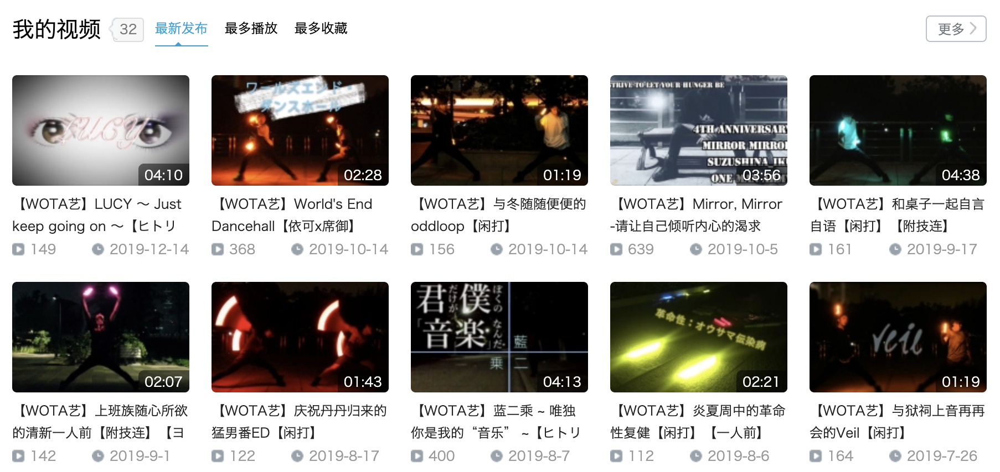

一口气想要把一年给总结完，结果越写越长。初稿从12月中旬就开始写，写着写着发现要总结的东西越来越多。时间从十二月中旬拖到一月初，最后心想：算了吧，把之前列的大纲上有的，还有无论如何也想写进来的东西给写下来就好了。

<!-- more -->

---

可能是因为工作之后没有像学校那样的学期制分割，除了法定节假日休息之外基本都在工作，一年到头基本没什么明确时间节点。因此，一年之中的时间概念就这样模糊了起来，回头一看感觉太快了，明明只是进入社会之后的第一年而已。

为了明确一下思路，整体从六个方面来写，分别是**生活**、**社交**、**爱好**、**感情**、**经济**和**工作**。

## 生活

汉字词语真是好用，脑子里面想着怎么样才能方方面面的概括好生活这方面的情况，结果一想到“衣食住行”这个词就完全解开了我的迷惑。从我的生活角度，按重要程度来排序的话，应该就是住行食衣了。

### 住

在19年到来之前，我就已经在上海生活了将近半年左右的时间。就一个人生活来说，这还真是第一次，但我倒没有多不适应。有时候在自己经历了很多事情之后，再遇到一些第一次的情况，就不会像是第一次一样那么不适应，反而像是理所当然，脑子里面觉得这就是应该这样的。

从集体宿舍搬出来一个人住是因为工作，想要搬到离公司近一点的地方。我本身就还不适应挤地铁，还为了省点交通费，搬到离公司近、可以步行走过去的地方，对我来说非常方便。但说实话，我当初选择住到现在住的地方，并没有思考那么多，事后反而还有点后悔，因为房租相对于我现阶段的工资和房间本身的大小来说，确实是有些不理想。

就在这个月月初，我还在琢磨着搬家的事情，但想到明年3月左右该还的贷款基本都能还的差不多，而且明年的工资大概也会涨，准备重新跳槽的公司也离现在住的地方只有2个地铁站的距离，所以我暂时打消了搬走的想法。

这个房间很小，但五脏俱全，既有独卫也有开放式厨房。虽然集成在这些小小的几平方之中显得很挤，但对我来说，已经是很满足了。毕竟除了放假和睡觉之外，基本也都是在外面呆着，也没那么多需要考虑的事情。

话又说回来，一个人生活果然能够暴露出很多自己的问题，最典型的就是懒了。稍稍偷懒，房间就会乱的不成样子。特别是房间小，一进去就能看到床，如果床很乱，那打开门后的心情也会莫名其妙的一团糟。

因此，**东西的收纳需要时常注意**。我本来就是一个有一点积物习惯的人，一不小心就容易让这小小的生活环境充满了一些“无用”的东西。东西不怕放在那里，最怕一直不用，一直不用，基本上就算是永远不用了。真是又花了钱买，又占了空间资源。也不难想象当初父母是在什么样的心情下说出我出去过不好日子这样的话的了。

像整理东西对我来说应该是次要问题，毕竟我不是那种一年到头都不整理东西的人，只要东西足够乱就能够让我攒足动力去整理。基本上不超过两个星期我就会好好的整理一遍可见范围内的事物，但卫生就不是这样了。

到现在为止，最影响我的就是卫生情况了，我买回来的扫帚和拖把除了在刚买回来的那个月用过之外，就再也没有拿出来过了，这正是我重点需要改进的问题。**正值年末，可以考虑好好大扫除一番了**，我之前还有想过在家里打赤脚（我们家乡话光脚的意思）呢，是时候该实现这个美好的愿景了。

为了完整的清理好房间，还得去**买一个马桶刷**。9月左右马桶坏掉不能自动冲水之后就一直有注意不在家里上厕所了，就是怕麻烦。但卫生间一直脏兮兮的不去清理，继续拖下去也没用，毕竟我已经不打算搬走了，那么对我来说整一个比较干净的环境还是很重要的。

除了马桶刷之外，**还有地板垫、冬天穿的拖鞋和空气清新剂要买**。既然要继续住下去，除了卫生环境以外，我还想要好好地装饰一下房间，原本都打算不住了，所以房间都没怎么装饰了。前两天贴了几张以前留下来的海报，瞬间感觉有生活感多了。以后打算留意留意好看的**海报**还有**装饰物**，好好地改造一下自己的房间。

关于之前一直纠结的房间大小，我只是这样觉得：**关于在有限的空间里如何分配资源永远是一个课题，对于房间是这样，对于别的事情，也是这样**。

### 行

出行其实跟住有很大的联系，如果家就在地铁站旁边，也许会让我对于出远门探索这件事情更加的上心。但实际情况下并不是这样，除了打艺和外出驻场办公以及和朋友一起出去玩之外，好像很少有自己主动想要出去走一走的情况。相反，如果只是家附近的话，我倒是已经熟的不能再熟了。

我其实一直有**坐地铁把上海有趣的地方都给去个遍**的想法，但理想总是~~美好的~~需要付出行动的，除了行动，还有钱。

关于行，也没什么好展望的。**有买自行车的想法**，但住的地方不好放，硬要买的话，也许折叠式会比较合适。但怎么想也没有明年会买的感觉，毕竟下一份工作的地点还没有确定，如果还是继续在这个公司做，且经济情况良好的情况下，整一辆或许不错，毕竟出门的时候会方便很多。

### 食

人活着是要先满足生理需求的，对于我来说，首先是睡觉，其次应该就是吃饭了。今年在吃上，我却没什么能讲究的地方。除了外卖、零食和方便面之外，貌似就只有偶尔和朋友一起出去才会吃一些别的食物。当然，这些食物好不好吃还是另外一回事，不过大多数情况下价格是真的贵。所以我现在也比较抗拒出门吃东西，目的之一就是为了省钱，说是省钱，不如说是不让自己欠债吧。

当初租了能做饭的房子，结果一年到头却从来没有下过厨房，除了烧开水泡面。如果今年经济状况有回转，会**考虑买一些餐具厨具**，自给自足。说起来我还没有过独自一人买菜的经验，想到这里还有一点小激动。像自己做饭什么的，也是很早之前就偶尔又在脑补的事情了，希望明年能够有机会切实尝试。

刚刚看到驻场办公的同事吃着自己带来的水果，心想自己在营养补充方面也有很大的问题，明年应该**逼着自己让自己多吃点水果**，毕竟我本身也不讨厌吃水果。

还有喝水，明明今年生日的时候从打艺的后辈那里收到了之前说喜欢的水杯，结果拿到手之后也就用了一段时间，如今已经很少用了。为了身体，明年也**应该多喝开水**啊。

### 衣

穿着打扮我真的是没品位，而且经济上也很有困难，虽然想要买好看的衣服和鞋子，但实在拿不出在这上面的钱。前些日子，朋友帮我看了一件衣服，我也很喜欢，但那个价钱我实在没办法一下子拿出手，只能眼睁睁的错过。

鞋也是，更早之前跟另外的朋友在南京东路阿迪的专卖店里看到了一双自己很喜欢的鞋，但也是因为没钱买不起。虽然说朋友说了可以帮我出点钱什么的，但我对欠人情这样的事情比以往多了一些心眼，主要还是不想被这样的心情束缚自己，所以还是拒绝了。

不过，虽然说我想要买新的衣服和新的鞋，但除了鞋只有两双能穿，有点少以外，我的衣裤之类的还是够穿的，只是从别人的角度来看有的衣服很呆就是了。我现在也不是有钱争这个的时候，睁一只眼闭一只眼吧。

有的衣服因为很喜欢，所以经常穿，但衣服总是要洗的吧，就总有那种洗了之后需要马上穿这件衣服的情况。也为此，我很**想买烘干机**。在这上面犹豫不决的原因除了经济原因之外就是刚才提到的房间大小了。综合这些考虑，明年会看看有没有那种大小适合，自己也能够买得起的烘干机。

像这种提升幸福感的电器多起来，对于生活也是一种鼓励吧。

## 社交

在进入社会，与各式各类的人打交道之后，对一些事情的认识也越来越深。我很幸运，即使在陌生的城市也有着不少朋友——因为打艺认识的打师、培训班的同期还有大学毕业以后被我邀请进入同一公司的大学室友等等。但即便如此，我也认识到，**学会享受孤独也是一件很重要的事情**，在这里就不做话题展开了。

### 艺友

打艺是我来上海的根本原因，虽然从前就向往这个城市，但是，如果没有wota艺的助推，我可能很大概率不会来到这个城市发展。而现在联系的大多数朋友，都是上海的wota艺打师，从社交需求的这个层面来说，多亏了他们，我才能够继续坚持下去，不管是打艺还是生活。

上海的打师朋友中完全不缺少优秀的人，这也是我觉得非常重要，非常难得的事情。我在这一年中的很多成长都是受到了他们的影响——如果不是这个圈子，我可能很少能够接触到这样优秀的朋友，如果不是他们，我可能过很久在能得到这么大的成长。

不过可能是他们过于优秀，我太过自卑，又或者是情绪的起伏变化太频繁，导致时常会感受到异常的压力。我不擅长玩梗，也不会说话，所以有些时候无法融入进他们，我不确定，到底问题出在哪里，但这是我一直都想要解决的问题，希望明年可以改善这个问题。

除了上海的打师朋友以外，通过wota艺认识的全国各地的打师对我也有各种不同的影响。今年下半年我还整了一个自己的亲友群，其中基本都是关系不错的wota艺打师。在这个群里，我可以说自己想说的话，也不用担心自己太过ky。只不过我有一个很恶心的毛病，那就是动不动退群，太不成熟，太不理智，不改不行。

### 同事

工作之后面对世间最多的人就是同事了，在这方面，我认为交往中的分寸是比较难掌握的。

我这个人大概就是不熟悉的时候很难接近，熟悉了之后就会放下戒备，但同时自己也会放肆起来。说简单一点，就是不懂的分寸，经常容易说错话，KY。之前在跟领导出去吃饭的时候，我就被大学室友说过我跟领导说出来的话太不合适了，没有分寸。

就如何做到待人分寸得当，是一个长久的话题。这一点并不仅仅只是对同事这样，对其他人也是这个道理。在与同事的相处上提出这一点的原因只是因为，同事是我接触时间最长的对象而已。

实际上之前就也有过对打师前辈说话分寸不当而得到恶劣评价的情况，这点不可否认，是自己做的不够好。

### 亲友

说到人际交往间的问题，物理距离绝对能算是一个“杀手”级的存在。特别是对于曾经关系好，但现在，因为地理位置的原因，逐渐疏远的朋友。我觉得很少有人能把握好分寸，而我就是那大多数把握不好分寸中的一者。

一般来说，人不能见面，最后一般都只能在网络上保持联系了，而我最不擅长的就是在网络上经常地保持联系。可能有时候非常孤独，就会在网上寻求人与人之间的依赖感，有时候非常繁忙，可能连现实中的人际交往也给忽视。但无一不能够体现出，我是一个无比自私的人。

我想到和前女友交往的时候，只有她来找我，很少有我找她的情况。再来，我基本昼伏夜出，跟她的时间完全相悖，只有打艺的时候能够见面，而打艺的时候，我却很少正眼看她，甚至还说她这说她那。

当我意识到问题的时候已经太晚太晚，但总归是意识到问题，也在改进了，真是难怪会有这样的话：

> 一生中要遇见很多人，有的人，遇见的不是时候，就是注定要错过。

认清了自己傲慢的现在，我也不会不主动去联系别人了，有的时候想到了某些曾经关系还比较好的朋友，就会主动去找他，但常常会想，是不是他会觉得我有求于他才会找他呢？难怪了，连我自己都这么觉得，我以前到底有多目中无人啊。

### 网友

对于我来说，列表里的网友，基本都是人生中的看客，我们互不强烈影响，但彼此静静地躺在各自的列表中。我不会打扰他们，也不会对他们说的一些内容提出意见，只是默默的看着。如果他们对我有一些强烈的影响，那么我也会试图走进他们的生活（褒义。

而不管如何，在现在这个时代，也许他们对我来说并没有那么大的影响力，但也是我生活中不可缺少的一部分。

用什么样的态度和心态对待这些网友，我觉得也算是一个课题，毕竟面对他们也是面对自己的一部分。

### 家人

<!-- todo -->

我对于家人的态度是冷漠的，可能只是我不擅长表现自己的心情。自从今年工作了，除了过年这样的长假以外基本就没怎么回过家。

我小时候一直觉得家人是一种负担，家里的很多事情，我都不想正视。所以，自从在住宿制的学校上学以来，我基本上就不怎么会想家，该回去就回去，能不回去那就不回去。

这种情况从大学以来越来越明显，直到现在工作，终于，今年内大概回去过的次数用一只手也能数得过来了吧。

不过还好，今年我不想再这样下去了。我其实心里也在想，假如有机会，也跟父母多说说自己的兴趣爱好，多聊聊自己的事情。特别像是我的奶奶，年纪已经很大了，再不去关心，也许就没有关心她的机会了。

之前在《[【Aha视频】北京深夜的漆黑角落，是中年男人仅剩的一点乐趣
](https://www.bilibili.com/video/av71395664)》中，又看到别人了这么样一段话，对我很有感触：

> 他养你小，从这么大给你养一百多斤，你不该养他老吗，好意思你说孝吗，我说不出来。

其实限制我回家的主要因素，还是工资不够，自己也不省钱。平时虽然跟家里人说钱够花了，但往往总会因为一些意外，导致每个月总是差钱花。

家里对外都说一些关于我的一些骄傲的话，我自己也知道，所以更加成为了自己的负担。也为了不让家里担心，我总是不说出来自己的痛楚。这种负担从另外一种角度来看也是造就现在的我的一种动力源。

这些问题在新的一年，我也会去解决。特别是经济问题，基本上解决了这个问题，我的大多数痛苦都可以得到缓解，甚至根除。

## 爱好

今年算是有好好地在做自己喜欢的事情，不过从10月底开始，加班越来越多，也越来越把放在一些重要兴趣爱好的精力给分散开来了。工作和爱好上的比重是现在比较困扰我的问题，在此之上，又想发展更多的爱好，值得好好地想想接下来的路。

### wota艺

今年除去之前删掉的视频，一共做了20个作品。除去“认真”做的3个一人前企划之外，分别做了9个双人、4个三人、2个一人前和2个五人番队。

不说作品，这一年也发生了很多对我影响很大，并且值得记录的事情，借着年终总结的机会总算可以好好的理一理了。

<!-- todo -->

#### 第一届CDWB决赛

从嗷君那里拿到了CDWB的周边衣服。

<!-- cdwb 衣服 插图 -->

#### 初至同济

同济的樱花很好看。

<!-- 同济樱花 插图 -->

<!-- 同济樱花 视频 -->

#### 第一次通宵艺

第一次彻夜打艺。

<!-- 彻夜打艺 插图 -->

#### 7th trigger

能够选上我，我真的觉得非常荣幸，但同时，自己看着自己现在的这幅德性，有些对自己失望了。

<!-- 7th trigger 插图 -->

#### 参与BML演出

当时是打算做一篇完整的记录的，结果一拖再拖，最后还是放到年终总结里面了，这么一看，年终总结这么臃肿的原因也得到了解释。

<!-- bml 演出插图 -->

<!-- bml 视频 -->

#### CDWB上海赛区预选

其实关于CDWB那段时间发生的事情，我也是打算写一篇博客来总结的，可惜，最后还是给我拖没了。

<!-- cdwb 插图 -->

#### 加入Team·Camelot

能够加入Team·Camelot，我觉得完全不是实力达标了，只是自己的热情届到了。也是因此，我现在一直纠结于自己水平的局限，并担心在视频中会不会拖后腿。最典型的体现就是，在第一作中，我出现了至少10初失误。

<!-- team·camelot 插图 -->

### 那些没能坚持下来的

#### 画画

因为ipad闲置的原因，所以我秉持着手头资源利用的想法，决定把她利用起来。受喜欢的人的影响同时加上很多其他因素，我很早就考虑学习画画了，apple pencil + ipad的这种形式看起来也不坏，我觉得可以尝试，就用京东白条入了apple pencil。除此之外，在了解了一些ipad上的绘画软件之后，我在app store里买了procreate。

<!-- app pencil 插图 -->

<!-- procreate 插图 -->

实际上手用了apple pencil之后，我觉得并没有辜负我当初的期望，用起来还是很舒服的，但就画画水平来说——完全画不出来东西。画画这种东西就是需要花时间去练习的，但画不出来东西就会有抗拒，然而越抗拒越是不付出时间就越画不出来东西，到头来还是慢慢的让apple pencil吃灰去了。

在刚入手apple pencil期间，我还从朋友那里拿了他之前学习的网课。他认为我肯定能坚持下去，所以我一直心里有一种不是滋味的感觉，别人相信了我的能力或者潜力，但我却没能拿出相应的成果。只是我还没有打算放弃，先降低自己对目标的要求，然后脚踏实地的前进就是接下来的行动方针。

#### Breaking

想要练习Breaking是很早以前就有的想法，但真正去练习还是从9月份左右开始的。想要去学习的原因除了觉得Breaking很酷之外，还有三个很重要的原因，一个是Wota艺打师ホツー在Wota艺领域的一些表演和作品让我很感兴趣，另外一点是因此对Wota艺和其它舞种的交错抱有一定的激情，最后就是RAB的新作品和新成员带给了我很大的冲击。

我的练习途径基本上就是靠在b站上找教学视频来练习，然后通过一些炫酷的Breaking Battle视频来提升自己的学习热情。毕竟第一次接触，而且还是一个人独自训练，这样的练习还是有很多的瓶颈的。特别是体能方面，对于Breaking来说，很多动作并不是像Wota艺那样，学习了动作之后反复练习就能变得更加熟练。在最开始还是需要体能基础，特别是核心力量的要求，为了这个我也去锻炼身体了，但也没能够坚持下来，可能也是因为这个原因，Breaking的练习也懈怠了。

我在考虑，如果要坚持练习下去是不是专门去报一个课程比较好，但这是需要钱来支撑的，在这之前我先看看能不能打好体能基础吧，毕竟基础体能的优化对于我自身和打艺来说都是利大于弊但事情。

#### 健身

健身的训练基本上跟Breaking的练习是同时开始的，放弃的时间基本也是同时的。如果明年打算重新把Breaking给拿起来，那必定就需要带上体能训练。也正如前面所说的：

> 体能基础的优化对于我自身和打艺来说都是利大于弊的事情。

PS：其实应该是我先是开始身体锻炼，然后才开始Breaking的。而开始身体锻炼的原因则是因为看了《[肌肉少女](https://www.bilibili.com/bangumi/media/md28221412)》。

### 那些想要开始的

#### Bass

想要开始学Bass是因为看到了两个惊艳到了我的视频，除此之外，学一件乐器是我很早之前就已经在想的事情了。不过，鉴于现在住的房子，还有经济条件，也许暂时无法开始吧。

贴一下这两个让我感到惊艳的Bass演奏视频：

[I, Giorno Giovanna, have a BASS](https://www.bilibili.com/video/av74596524)

[狂躁日本小姐姐贝斯疯弹《打打打打打打打打》](https://www.bilibili.com/video/av76001933)

#### 摄影

摄影是很久之前就有想过入的坑，只不过没钱，所以没有办法开始。今年看年终能发多少钱下来，如果够，那我就整一个a6400，这样不仅能够摄影，还可以录制wota艺视频，甚至还可以录制vlog，一举多得，何乐不为呢。

说到录制vlog，我之前有一个录制长跑路程vlog的想法，但如果是这样，就不好用a6400来做了。综合之前看的一些设备介绍，也许go pro是一个不错的选择。不过现阶段还只是想法，等到适当的时候再去做吧。

#### 游戏

<!-- todo -->

据说2020年PS5都要出了，可是我到现在都是一个没有正式买过家用机的人，之前在大学的时候从同学那里二手入了一个PS3，结果也没有玩过就寄放到朋友家里了（悲。

PS4平台上想玩的游戏太多了，自己特地整了一个[收藏夹](https://space.bilibili.com/1395467/favlist?fid=792199367&ftype=create)，等攒到钱买了PS4就把这里面的游戏先买了，也算是一个动力清单吧。

#### 读书

今年完完整整读完的书有两本，一本是《把时间当作朋友》，另一本是《小狗钱钱》，这两本书都对我来说都算是不错的书。也是因为看了这两本书，越发的觉得读书很重要，所以一鼓作气就在年末写了一篇《[2020年的读书计划](https://ikundefined.github.io/2019/12/15/17.2020年的读书计划/)》。

其实只要明年读完3本书，就算是超越自我了，毕竟从从不读书到养成读书的习惯需要一个过程，我可不想一上来就把自己逼到憎恶读书的地步。

#### 塔罗牌

12月中旬的时候看到了了一篇情感博文《[关于那些遗失的人](https://covermusic.cn/hui-about-lost-people)》，我觉得很触动我的心弦。在这篇文章的最后，我看到作者的文字里面写到了一些星座的痕迹，这让我联想到了，我遗失的她，她也跟我提到过星座，然后我就一个头脑风暴，联想到了塔罗牌。曾几何时，我也有过想要学习塔罗牌的“奇思妙想“，但现在我觉得，学习塔罗牌只是一个时间问题。既然想要学习她是我的“命运”的话，那什么时候去学习，就也交给“命运”吧。

对于塔罗牌的想法，我在前段时间的[近况总结](https://ikundefined.github.io/2019/12/27/18.近况总结-191227/#塔罗牌)里已经写过了，这里就不再具体说了。

#### Tutting

第一次看到埃及手应该很早，但那个时候还不知道这种舞种叫做埃及手。而再次被埃及手惊艳到的时候是看到RAB的新成员ネス在加入RAB之后发布的第一个新作《[「RAB」宅男们跳《+♂》](https://www.bilibili.com/video/av69157785)》。

Breaking和Tutting之间应该会先选择学习Breaking，至于Tutting，心里先放着吧，还不确定什么时候开始。毕竟有那么多想做的事情，**做的时候只能一件件来**。

## 感情

感情这种东西，可能不适合公开记录，但毋庸置疑，今年，在感情上的波动实在是太大，也是因为感情问题，我自己成长了很多，很多。还是在这里写一写感想，具体的事件就不过多描述了。

我对于一个人喜欢可能没有这么强烈过了，但说是爱，我觉得可能还不够吧。在《高分少女》第二季中听到了一句话，觉得很有味道：

> 愛は真心、恋は下心。

具体说怎么强烈的话，大概就是——每天都能想到她，做梦也会梦到她。我觉得从我的角度已经很能说明问题了，从小到大，在我的梦里都没有梦到过喜欢的人，除了她以外。可能是她让我开窍了吧，但是太晚了，一切都太晚太晚了。

已经重新抱起喜欢她的心情快要一年多一些了，但我基本已经看不到希望了。不过，看不到希望也许更好，希望放在眼前总是会让人有一种自以为是的心理，一种侥幸的心理，这样的心理总会给自己的行为带来一些偏差。换做我来说的话，基本上就是偷懒吧，在各种各样方面偷懒，或者说不作为。

想想今年12月14号送她生日礼物，也是因为觉得我们之间大概率没有可能了，所以想要和自己的心情做一个诀别，但结果却越陷越深。

很多朋友在和我聊天提到情感话题的时候，都会劝我放弃，我也可以理解这种想法。但活到现在，第一次遇到这么喜欢的女孩，各自又都还在各自的青春年华，怎么舍得眼睁睁地放手呢。最主要的是——我自己没有放弃这段感情的心。

追求如果太激进可能会被烦，不作为又可能就会完全的形同陌路。但从她的角度出发，也许她的世界里面少了一个我，可能会清净很多吧。我不懂她，我猜不透，所以我只能凭借自己的臆想做出决断，也许那些所谓为她所着想的思考，只是为自己的不作为做一个开脱罢了。其实我只是做出了一种选择——默默的等待。或是等待时间让我忘记，或是等待时间让她回来，或是等待一个我不知道的未来，但留给我自己的答案很简单：活在现在。

在现在的情况下，不论选择什么，对于我来说都会是一种痛苦，但我要做的就是live with it，带着这种痛苦，平静地活下去。

卡夫卡的《城堡》中有这样一段话，我觉得可以用来描述我现在心中所留存的一点希望：

> 努力想得到什么东西，其实只要沉着镇静、实事求是，就可以轻易地、神不知鬼不觉地达到目的。而如果过于使劲，闹得太凶、太幼稚、太没有经验，就哭啊，抓啊，拉啊，像一个小孩扯桌布，结果却是一无所获，只不过把桌上的好东西都扯到地上，永远也得不到了。

人生没有迟了这一说，什么时候学会都是值得的：

> 爱任何事物的方法，就是要意识到你可能会失去它。

<!-- 年初她和朋友在一起 => 淡忘 => 她和他分手 => 重新出现在我的视线中 => 我试图做点什么 => 自以为成长 => 失败 => 给她的第一个正式视频 => 冷战 => 打算再次做点什么 => 给她的第二个正式视频 => 也许是时候结束了 -->

## 经济

<!-- todo -->

从独立生活开始之后，经济状况是不得不强调的一个重要问题，同时也是

今年

还培训贷款

还京东

还借的钱

还花呗

房租

生活费

小狗钱钱

记账

短期总结

失败的账单管理

月光族

## 工作

作为**前端工程师**，**技术**肯定是需要第一位考虑的事情。毕竟我才入职一年，还没到需要考虑更多的事情的年龄。但时间过的是飞快的，至少应该事先想清楚下一步该怎么走，所以**职业发展**上也应该稍作考量。除了这两点之外，最需要考虑的问题应该就是入职以后我一直存在的一个大问题：**效率低下**。

不过效率问题已经在[近况总结](https://ikundefined.github.io/2019/12/27/18.近况总结-191227/#效率)里面提到，并且已经把问题和改进方法说的很清楚了，所以这里就只着重写一写技术上和发展上的内容。

### 技术

今年技术上的长进我也不知道怎么描述，进步肯定是有的，但是多是少我心里就没数了。因为公司的主要业务属于物联网，而作为前端，只有我和我喊来的大学室友两个人，所以根本没法有个像样的对比，再来，我的室友在技术层面上超出我太多，没办法感知到我的成长。

今年技术社区混的也不积极，更不知道自己在整体水平上的高低。平时基本上只有两个状态：要不觉得自己在应届生的层次里很牛逼，要不觉得自己在应届生的层次里很垃圾。只有写代码的时候，才会静下心来不去思考那些问题。这么一看，做一下年终总结更有必要了。

刚进公司接手的项目就由两个小项目组成，而这两个项目一个是Vue技术栈，一个是React技术栈。我的职责就是负责这两个项目的维护、接口对接以及上线。在培训班时期只是粗粗略略地过了一边Vue，而React基本都没怎么看过，所以接手项目之后，感觉可以让自己好好地过一下以前学习的Vue和重新学习一下React。

在过年之前，我对接了Vue项目和React项目的数据，同时也完成了项目的实际上线。在搞清楚了Vue项目的整体框架之后，也开始着手准备重构了。那段时间也没有学到太多具体的东西，主要就是熟悉了一下Vue技术栈，同时顺带了解了这个Vue项目里面使用的UI库——VantUI，并且把React硬生生的啃了一点下来，还了解了一点AntDesign。虽然React项目新增需求部分的代码大多都是复制粘贴后修改的就是了。

哎，没想到现在唾弃无脑复制粘贴的我，曾经也是一个冷酷无情的复制粘贴工具人（x。果然，勇者终成恶龙。

在过年回来之后，我着手继续重构手头这个Vue项目的源码，在重构的过程中加入了Vuex，但这个时候的我还不知道Vuex的灵活用法，这次的引入只用了皮毛。重构过程算是把业务逻辑也给捋了一遍，同时还把项目的架构重新的规划了一番，当时已经觉得挺不错了，降低了许多组件的复用，同时项目的架构清晰了许多。

在这个完整的项目之后，突然来了一个有大屏展示需求的项目，这个时候我已经邀请我曾经的大学室友进到了我们的公司。因为这个项目来得太突然，时间要求紧迫，再加上需要用到的技术我们不太熟悉，导致那几天我们接连加班，但总算把一块大骨头给啃了下来。

因为这个项目主要是由我的室友主导，所以用了他熟悉的DvaJS。而我负责的部分主要是图表，在那段时间我好好地了解了一下Echarts。项目收尾的时候遇到了数据接不通的问题，我辅助了我们的后端大佬搭了一个简单的Node服务器来乘载我们先前用来模拟数据使用的mock服务。

具体一点的记录在《[地狱一般的加班与其后的黎明](https://ikundefined.github.io/2019/03/22/4.地狱一般的加班与其后的黎明/)》这篇博文里面都有写，反正那段时间真的是加班加傻了。

做完了第一个“大屏”项目，我们的老大又给我们带来了另一个大屏项目，而这个大屏项目需要引入3d功能，我和我的大学室友两个人就开始在网上搜罗起方案来。找了Thing.js、Three.js甚至是unity3d这样的解决方案，但最后都因为成本和风险问题放弃了我们自己去做的选项，也不考虑交给“专业”的外包团队。我们老大另寻出路，找到了一个承包网页方面3d相关制作的小团队开始做这个项目。而在了解网页3d相关技术的这个过程中，我对于网站使用的webgl、three.js这样的技术也有了一些初步的了解。

与此同时，另外一个大屏项目也同时开始了。之前提到的第一个“大屏”项目用了双引号，是因为这个大屏项目并非真正的大屏，只是展示用，屏幕稍微比正常的屏幕大了一些，而其后提到的大屏项目基本都是在指挥中心使用的大屏。

这个大屏项目是和另外的公司合作的大屏项目，因为另外那个公司手头活太多，所以没有办法多个项目同时并行，所以把一部分工作外包出来，我们就是外包了他们的这部分工作。工作内容主要是两个页面的UI制作以及四个页面的数据接入。

而在这个项目开发起步同时，这个公司还外包出来了他们之前做过的一个大屏项目中的两个需求模块，这两个需求模块相当于嵌入进这个大屏中的两个子页面。然而这两个模块都属于暂时画出了原型图，并没有明确的程序实现，他们手上只有自己写的其中一个模块的一个半成品。

<!-- todo -->

崇明大屏

electron vue d3 vuex 接口文档

养老社区第二次重构

vue 图片压缩 项目架构 vuex

奉贤大屏

场站大屏

社区App

### 发展

<!-- todo -->

进入社会以后变化的事情太多，但自己也没有什么不适应，不过我觉得只是我运气太好而已——上海这个城市有打师朋友，以前的大学室友也和自己在一个公司工作，领导也比较容易相处。也正因为运气好，所以才应该多考虑将来的事情。虽说将来难以用计划囊括，但无论如何，做一点打算总比走一步看一步要稍微好一些，当然，前提是确确实实的行动，没有行动不如走一步看一步。

2019年最后一天正好和大学室友跟领导坐下来谈过一些事情了，心里很多石头终于都放下，也可以安心的做一下下一年的职业发展规划了。思考将来的发展主要就是**结合现在的处境和目标来做一下基本的规划**。先说一下今年的概况：

从[经济]()上来看——工资虽然不高，不过足以支持生活，虽然需要用上花呗和借呗，但思考具体原因，那还是因为自己管理资金不妥当，之后在[经济]()当中再细说。

从[生活]()上来看——能够在上海好好地生活下去，虽然还有很多限制，但基本上都是因为经济原因导致的。也就是说只要有钱就可以过更好的日子，除了这些限制之外，我过的倒没有多不好。

从[社交]()上来看——主要还是没钱，要不然和朋友出去玩的机会可能更多，窝在家里哪有社交呢（x。

从[爱好]()上来看——很多爱好还是需要有钱来支撑的，这是没有钱就很难解决的问题，低成本持续下去也行，但不是长久之计。

从[感情]()上来看——一言难尽。。。

用一句话总结是：今年过得挺好，但有钱能过得更好。

为什么发展这个话题明明所有点都涉及到了，却不作为一个大块来写呢。我是觉得，现在生活中，工作就是主线。即使是所有问题的核心——钱，也是直接跟工作挂钩的，所以将来的发展主要还是整理一下工作上的发展就好。

比大学时期见过的人要更多了，与各式各类的人打交道之后，对一些事情的认识也越来越深，但对自己发展的方向却又感到了一些迷茫，现在和将来的目的很简单，就是赚更多的钱，但同时，要过更舒服的日子。在这个前提下，好好思考一下将来的职业发展。

---

以上写的这些内容，其实每一点都可以展开来写，但日常也没有太多时间可以挤出来，每天写的话灵感也不能保证一直都在。实际上在写的过程中，我的想法也出现了很多变化，有些觉得很好的内容，没来得及写就忘掉了。而有些时候则是写着写着又冒出了新的想法。

年终总结这样的东西还是简单的写写就好，环顾了别人的博客，也没见几个写长篇大论的。不过仔细想想，本来这东西就是我写给我自己看的，写那么详细也不坏。从另一个角度来说，明年应该多做周小结、月小结之类的，这样的总结能够及时反映问题，及时改进自己，同时也能减少年终总结的负担。

在最后稍微做一下对2020年的一写展望：

2020年是收束的一年。

收束 -》 扩展
