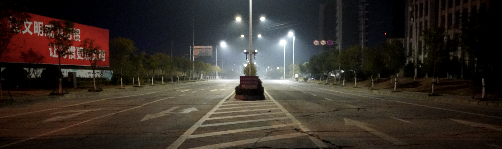
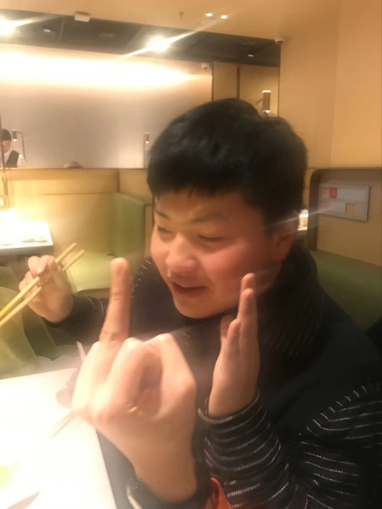
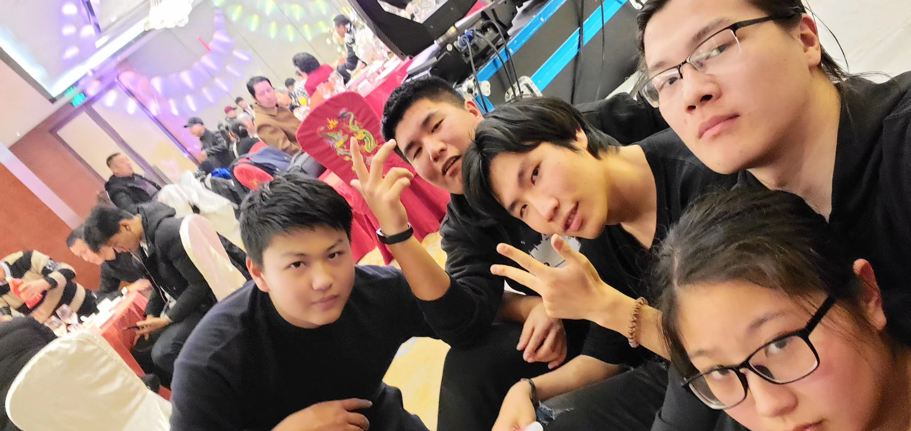
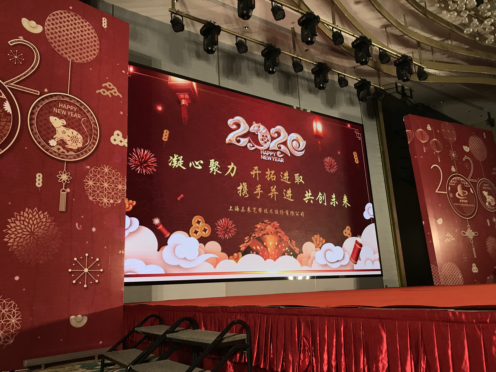
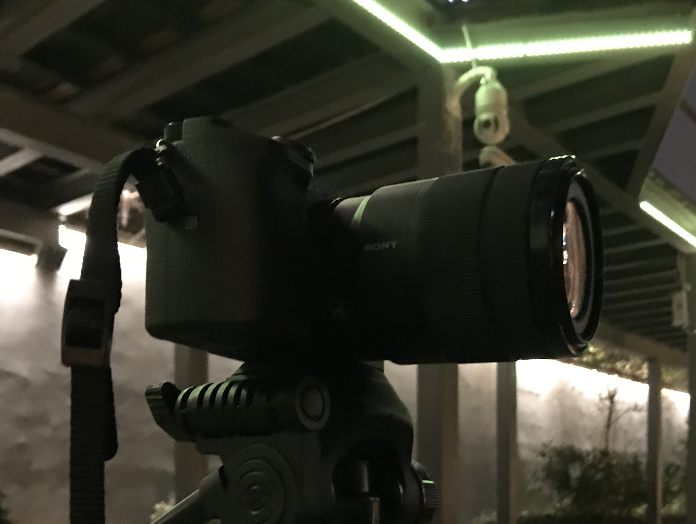
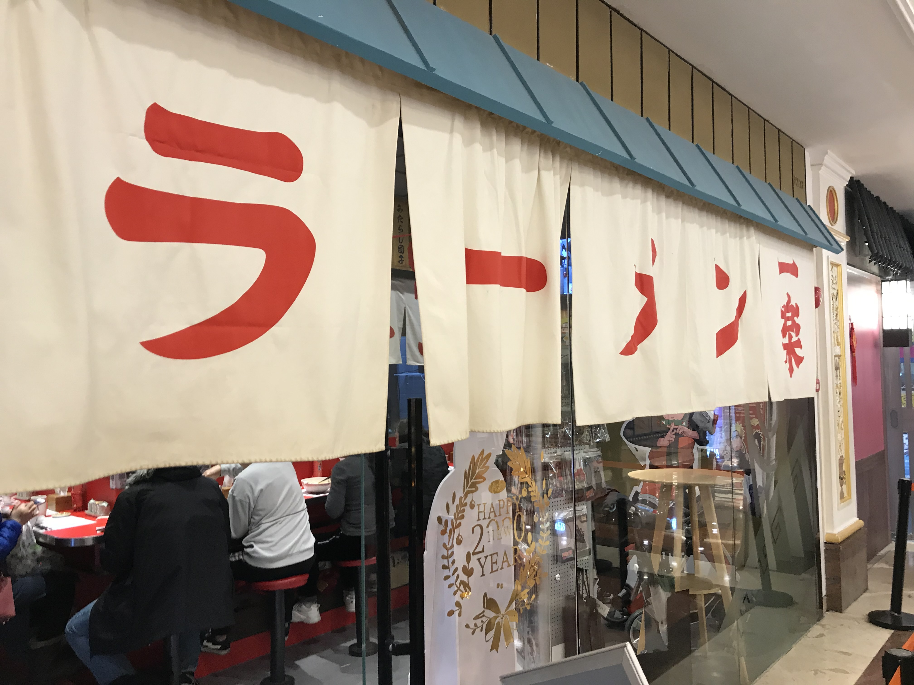
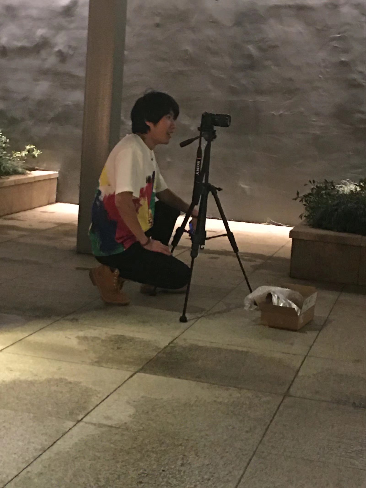
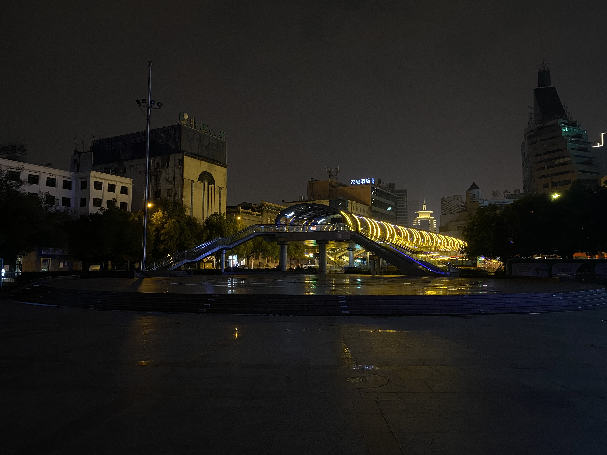

这个1月下旬，受到新型冠状病毒疫情灾害的严重影响，我的预定行程受到巨大的影响。也是因为这个状况的影响，明明是新年，却过得一点年味儿都没有。这几天正好闭门不出，所以总结一下1月发生的很多事情，同时也好好整理一下心情，应该回归日常了。

<!-- more -->

---

1月初没有什么值得浓墨重彩去描写的事，无非就是日常，值得说的事情还要从1月10号开始写。

## 过年前的一些事儿

### 表哥结婚

因为1月12日我表哥要结婚，所以我临时决定11号回去一趟。10号下午，我哥打电话跟我说想让我在他的婚礼上表演WOTA艺，我一口就答应了下来，但我觉得一个人表演可能节目效果不是太好，就决定召集几个在芜湖的打师一起上台表演。想好之后，我就在自己的群里@了一些我觉得可能参加这次表演的人选。在得到一些回复之后，我决定让他们11号晚上一起出来录点视频吃顿饭，顺带排练一下12号晚上要表演的编排，之后让从外地来的打住我家。

11号当天，我回到家之后发现家里因为一些特殊情况住不了人，父亲见况就给了我点钱让我和他们一起住宾馆，我也就答应了下来。夜幕降临，按照约定好的时间，我们在芜湖的苏宁广场碰了面，从苏宁广场走到了滨江公园，一路看了看有没有适合打艺的地方，最后还是决定在滨江公园那里录视频和练习。虽然当天天气很冷还有冷风吹着在，但大家还是一起整了点视频，并且把第二天要在婚礼上打的编排给理了一下。在这之后，我们就一起去了海底捞聚餐。

虽然每次吃海底捞都挺开心，但不得不说，这次确实是最开心的一次——吃肉吃爽了，聊天聊爽了，喝酒喝爽了。而且这些都是和关系不错的打师朋友们一起，可能近期不会有能够让我这么愉快的聚会了。比较有问题的是，当天晚上喝得有点上头，晚上住宾馆的时候搞的大家睡不着觉，我自裁。

1月12日，我哥结婚当日，按照预先约定的一般进行了表演，过程也比较顺利。表演结束之后和打艺的朋友们在一桌吃了饭，不过气氛比较尴尬，因为除了我们几个都是不大认识的人。这是我第一次遇到这种情况，组织的时候没有想太多，只想了打艺的事情，并没有做太多安排。在这个方面确实欠妥，也的确需要自己学习。值得一提的是，这是我第一次在婚礼上表演WOTA艺，算是一次比较崭新的体验了。能够让自己身上的闪光点让别人感到快乐、有趣，我觉得也是一件有意义的事。

吃完喜酒之后，我直接订了13号凌晨的火车，想着早点回上海，好好休息一下，反正13号请了一天假。坐车到了上海，我发现坐地铁回去的话正好能赶上上班的时间，我就想自己在火车上也休息过了，而且在坐地铁的时候还碰到了同一个部门的同事，干脆直接去公司上班吧。也就这样，在公司熬了一天。

### 公司年会

1月14日，公司年会，我之前喊了Team·Camelot的几个伙伴和三水一起来年会上表演WOTA艺，这也是我第一次在年会上面表演，也是一次难得的经历。表演的整个过程没有什么好说的，但能够把冰连凋和炸毛也给喊过来确实也让我有些惊喜，我很高兴能够和他们站在一个舞台表演节目。更重要的是，还和他们在年会上一起吃了饭，我觉得这让我们之间的关系得到了进一步的提升。之前在年终总结中也有提过，我对于Team·camelot的成员们总有一些疏远感，我觉得这是我自己性格的原因造成的。能够在这次年会喊他们一起来真的是太好了，不过也遗憾，嗷君因为上班的原因没有能过来。

在这个年会，还有另一个需要提的事情，也就是我喝酒的问题。这次年会我喝了很多酒，导致了断片。听同事和朋友们说我没有做什么太影响别人的事情，我觉得这是不幸中的万幸。最不幸的是，在坚持了十余天写手帐的习惯之后，我把两本手帐弄丢了。这两本手帐，一本是我很喜欢的样式，另外一本里面有着无可替代的回忆，同时这两本手帐里面记录的内容对我来说都非常重要。也是因为这个事情，我觉得对于喝酒这个事情来说，我需要跟自己做好工作，必须要好好改善。我准备找时间写一个醉酒记录，把我因为喝了太多酒之后犯过的比较严重的错误都记录下来，警示自己。

除了弄丢手帐以外，可能是因为喝了太多酒，晚上睡觉不注意着凉了，年会结束后的第二天我就开始感冒、发烧还有扁桃体发炎。发烧大概持续了两天，扁桃体发炎过了几天也好了，但感冒一直到我现在写这篇内容的时候都还没好。不过幸好这件事情是在1月15号开始的，毕竟我也不会知道1月20号左右的时候武汉冠状病毒的疫情会变得那么严重。那段时间，我坐地铁都不敢咳嗽。

### 归乡前的倒计时

1月15开始，一直到1月19日，开始了年前最后的项目赶工，也就是年前最后的加班生活，这段时间也没有什么特别的地方。想提一下的是18号的时候，从领导那里拿到了这段时间做项目得到的额外薪水，当晚我就网购了一直都想要的a6400，同时也约了冰连凋21号下午陪我去买新年穿的衣服。

我们公司原先是说从23号放假，所以我买的车票是23号凌晨的。同时因为种种原因，我请了20～22号三天假。所以从20号开始，我的年假应该就算是开始了。

1月20日，开始放假，当天和Team·camelot的成员们一起去舞房练习了新作的编排。说实话，我觉得新作的一些编排动作对于我来说还是很有难度的。对于我来说，每一个Team·camelot的正式作品都是一种的挑战。但也幸好，因为各种原因，新作没有办法在年前录制了，所以我要把握住休息的这段时间，好好地练习和巩固动作。对于我来说，并不是仅仅只在这个团队里面就好了，而是在这个团队里面做最好的自己，让这个团队看上去更厉害，让自己也比之前的自己更厉害。

1月21日，约了冰连凋出来帮我看衣服，同行的还有沙包前辈。没有想到年终总结之中提到的穿衣问题这么快就得到了改善，能够让比我有穿衣品味的人给我选衣服我还是很高兴的。在买完衣服之后，当天晚上还去浅水湾参与录制了冰连凋的[梦之空地](https://www.bilibili.com/video/av84646975)。

1月22日，因为前一天下午出去的比较迟，所以还有裤子没买，这一天约了冰连凋去环球港买衣服。经过这两天，自己也更多的体会到了一些逛商场的乐趣了，如果有机会也想跟喜欢的人一起去逛街。顺带一提，这天晚上去吃了开在环球港的一乐拉面，这期间还偶遇了炸毛，买完衣服之后还在环球港附近帮冰连凋录了梦之空地的间奏。

值得拿出来说一下的还有，这几天的约定，我基本都迟到了，我觉得这也是我一个必须要好好改善的地方。约定是很重要的，在约定的时间做好约定的事情是最基本的事情。不光是约出去玩还是工作，不管是什么对象，约定就是约定，希望这点我能够好好想清楚。

因为回去的车票是23号的凌晨，所以买完衣服也没有弄太迟，赶紧打车就回家了，毕竟还要收拾一下行李就要走了。也正好，a6400的快递到了。回头一想，那几天过得也是非常开心。

1月23日，晚上坐高铁回了芜湖，也就是这一天凌晨，在微博上看到了武汉封城的消息，疫情开始变得严峻起来。

## 没有年味儿的新年

### 没有实感的日子

从23号开始，各个城市就开始了对疫情的戒严，因为疫情初期还没有特别严重，所以我还是打算冒险和愿意出来的朋友见见面。

1月24日，除夕，在和家里人吃完年夜饭之后，约了以前的圈友出来逛逛街，然后去海底捞吃一顿。但那天海底捞的营业结束时间比较早，也没能吃成，就直接和她在滨江公园逛了逛，顺带录制点视频看看新设备的录制效果了。

1月25日，大年初一，去大姥家拜了年吃了中饭。那之后，我带着两个表妹去逛了商场，给了她们一人一千的预算，给她们买点东西。活到现在，终于有了点做哥哥的感觉，也感受到，和家里的同辈们打好关系也确实是我想做好的事情。在给她们买完东西之后，我一时兴起，就去苹果店给自己换了部手iPhone11，但不知为何，一点换了手机的实感都没有。

1月26日，大年初二，关系亲近的亲戚们都来了我家过年，我却一点年味儿都感受不到。不知道是因为家的问题，还是因为疫情的问题，不过我觉得，可能只是我自己有问题。在吃完饭之后，我出去试着找地方录视频，但是因为下雨的原因，就没有录制了。相比前两天来说，这一天更能感受到，大家对于疫情防范的重视，家附近基本没有人，街上能看到开着的饮食店也只有一家。即使是过年，这个情况也过于异常了。

### 不完整的安徽巡回

想着在家里继续待下去也没什么意义，我就想好好地完成之前计划的安徽巡回。正好，之前订的一箱化棒也在前两天送到了。问了一圈想要见见的安徽打师朋友，决定先去蚌埠和彗星见一面，这也是我觉得很重要的一件事情。在他同意出来了之后，我就定了27号去蚌埠的车票。

1月27日，中午去母亲家吃了午饭，然后就直接去了火车站。下午5点多到的蚌埠，彗星接我直接去了他家附近的一个酒店，订好房我们就去超市买了点零食和酒水，之后整理了一下就去打艺了。和他见面我觉得最重要的并不是打艺，而是喝酒聊聊天，这之中也有一些比较复杂的过往，就不在这里详细说了。

<!-- 对于我来说，原谅心里对他的执念是对我自己的一种救赎，但即使是现在，我也会有想不开的时候，想不开自己为什么要轻易原谅他的想法。但我觉得，我其实不应该不原谅他，就像我刚才说到的那样，原谅对他的执念是对我自己的救赎。 -->

在打完艺录制完[视频](https://www.bilibili.com/video/av85541747)之后，我们按照计划去买了点烧烤回到酒店喝酒。在喝酒的过程中，我知道了很多事情，这也是我想要见面聊的原因，毕竟有的事情，隔着屏幕，难得真心。虽然有时候面对面也不一定真心相对，但我认为他还是能够真心相对且值得交往的朋友的，这点貌似对他来说也一样。不过对于我来说，只要对她的喜欢一天不减，对他的一些怨念可能也没有办法简单消失，这也是我应该自我治疗的地方。

幸好，这天晚上没有喝的大醉，也有可能只是因为我一个人住的原因，我没有怎么闹腾。在他走了之后，我拿出电脑后期了一会儿，然后就自然而然地睡着了。我觉得如果这样喝酒，喝醉了以后是这样的结果，也许就没有必要写什么醉酒记录了。

1月28号，我在整理好东西之后，中午退房直接去了蚌埠南站，准备坐高铁去合肥，因为前一天约了以前在学校一起打艺的学长。原本以为这个时期不好约他，却没想到他会答应出来一起吃个饭录点东西。在当天和他吃完晚餐之后去了合肥市中心的一个广场录了[视频](https://www.bilibili.com/video/av85726169)，结束时我看时间不晚，就买了当晚回芜湖的车票。这时，疫情已经越来越严重，大家渐渐地不敢出来了，同时自己带出来的化棒也已经不够用，迫不得已，只能回家。

### 被迫取消的会面

从1月29日开始，直到开始写这篇记录的2月1日，我基本上一直都在家呆着，除了偶尔出门到附近录个WOTA艺视频还有散散步之外就没有去过更远的地方了，也没有见别的朋友了。

原本预先约好要见的朋友基本都没有见着，除了除夕那天见了一个圈友还有27、28号两天去外地见的两个打师朋友之外，也就和亲戚见过面，跟往年相比太不正常。今年回家对我来说，和朋友见面是很重要的事情，我是很认真的看待的，就因为疫情的原因导致和朋友见面的计划被打破让我非常难受。我既不能责备因为特殊时期而不能出门的朋友，也不能修补因此而被打乱的计划，这让我感觉非常没有控制感，同时也让我觉得回来的意义减少了，因此非常失落。

我只能把这期望寄托于“有机会再见”这样我非常不喜欢的话语上，之前有一个朋友曾经对我说过：

> 好好享受每一次的聚餐吧，毕竟你根本不知道哪一次是最后一次，下次要隔多久才能见。

越是在成人的世界中生活，越是觉得这句话说得很有道理，是那种切身可以体会到的道理。也因此，我不想责难失落且因朋友们拒绝见面而生气的自己。

也因为这次疫情，我一个初中同学的婚礼延期了，我为他感到有些遗憾，过年期间最终也没能见他一面。等他婚礼确定好时间的时候能够再次邀请我，我也肯定会回去参加的。

<!-- 取消的会面，迟强，吴铭钰，武雨晨，房铭，杨子龙，朱剑锋, 肖尚超, -->

## 不如日常

敲下键盘，准备写下的是步入日常，结果输入法直接写出来的是不如日常，但这却意外地切合我想写的内容，一语双关。

当我写到这里的时候，已经是2月5日的早晨8:38了。因为各种意外的原因，年没有过好，作息时间也完全紊乱，同时时间也被自己浪费。这些都让我越发的觉得——不如日常。

闲在家里的那段时间，也做了一些稍有意义的事情，比如看了两部觉得很棒的电影，一部是《绿皮书》，另一部是《爆裂鼓手》。特别是《爆裂鼓手》，这部电影看得我感受颇深，也是我觉得以后可以再多看几遍的电影。

除了看了电影之外，在新年那几天录制视频的经历下，我也已经掌握了一些使用a6400录制出光弧，并且让视频看起来比较好看的技巧了。在出门带着a6400的时候，也会拍一些照片，这也越发让我觉得这个微单买的很值。有空打算补一补一些关于a6400的视频，学习一些摄影技巧。

闲着的那几天，大多数的时候都在睡觉，而不在睡觉的时候，自己大多时候处于不知道做什么事情好的无聊状态。现在这种状态下的心情跟以前这种状态下的心情已经大不相同，因为周围的环境和现在自己所处的位置已经不是以前那样了。所以自己状态很闲，但内心还是非常焦灼的。就在这样的情况下，我偶尔有一天打开了一言，看到了一句话：

> 无聊是非常有必要的，一个人在空白时间所做的事，决定了这个人和他人根本的不同。

这让我有了点顿悟的感觉，我只是把能做的事情放到了一遍而已，仔细想想，闲还是自己自己的问题，又不是没有事情做。我自以为自己够理性了，但每每遇到这种境况，我就会觉得自己太蠢了，竟然会相信自以为的事情。

现在我已经回到了上海，从到家的那个时刻开始，我的日常也必定会慢慢回归。但现在的自己终究还是收环境影响较大一点，可能只有等疫情完全抑制住之后，我的日常才能够真正回归吧。不过，我也希望自己能够得到日常控制的主导权。毕竟，有的事情，关键还是在于自己。

PS. 2月2日是个特殊的日子，给自己留了张截图。

## 一月读书总结

12月的时候做了1月的计划，先说结果，没有实现。说了要读三本书，结果就读完了一本《小王子》，《前方的路》读了前面一部分，《穷爸爸，富爸爸》还没开始读。

值得夸奖的是，读书这个事情一直在我心里，只是没有读，比以前好。不好的地方是，想没有用，最后我还是没有读完。

2月的计划不做很难，读完《前方的路》和《穷爸爸，富爸爸》就好。

---

开始写这篇文章的时候，是2月1号的晚上，那时候还在家里。而写完的时候却是在上海，2月5日早晨。

太应该反思了，每次写总结性的内容的时候就是喜欢拖，写到一半干干这，做做那，然后一篇内容分好几天才能写完。其实这篇内容还好，最终5天弄完了，像之前那个年终总结，花了一个月出头的时间才写完。也有一部分问题在于自己每次总结的内容都太多太细。

我觉得，想要把博客继续坚持写下去，最好还是要针对这两点好好改进一下。其实我之前在《断更的原因》中也写过，文章不要想着往多些。但从最近写的内容来看，只要我一写，就总想写多点。

这里就不再延伸去说了，毕竟这对我来说也算是一个很大的话题了。

今天早上看了一下疫情的发展情况，已经有2万多的确诊病例了，希望疫情能够早日平息，大家能够早日回归到属于自己的日常中去。