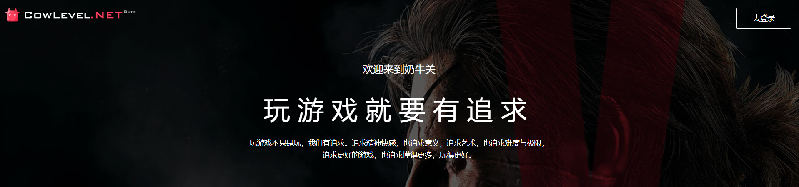
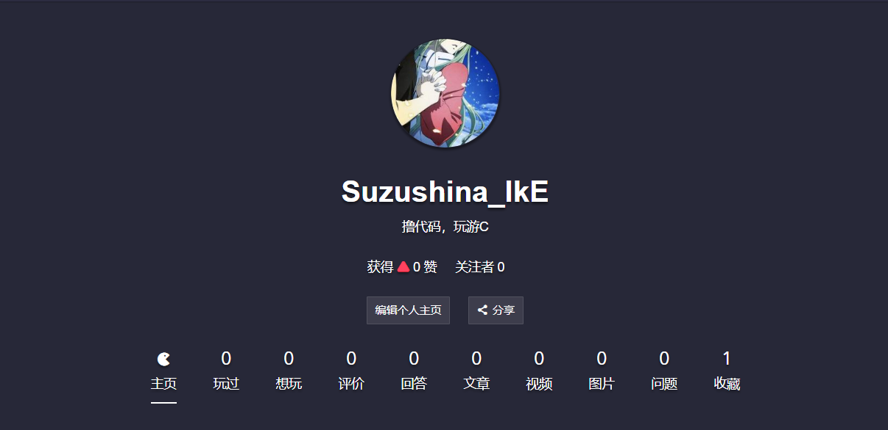

前些日子，在玩了许多RPG黄油的情况下，我去研究了一下[RPG Maker VX Ace](http://www.rpgmakerweb.com/products/programs/rpg-maker-vx-ace)，同时也翻了翻深藏在Github的Star清单里的[AVG.js](https://github.com/avgjs/avg-core)，原因很简单，因为自己有了做游戏的念头。

也因为**想要做游戏**的这个原因，我碰巧遇见了[奶牛关](https://cowlevel.net)这个社区，仿佛是打开了另外一个世界的大门。

<!-- more -->

***

先说说我想要做游戏的原因，不仅仅是因为玩了许多RPG小黄油，除此之外，还有室友兼同事的秦老哥用[Unity3D](https://unity3d.com/cn/)还有[Cocos2D](https://cocos2d-x.org/)做出的一些有意思的小东西比较吸引我，以及在最近小半年的工作里一直在接触许多网页图形相关类的一些工作内容让我对游戏方面有了点初步认识，这些动机一起组成了**我想要做游戏**的一股冲动。

凭着这股冲动，我去下载了制作RPG小游戏的[RPG Maker VX Ace](http://www.rpgmakerweb.com/products/programs/rpg-maker-vx-ace)，还在Github里面翻出来了Star了好久了的[AVG.js](https://github.com/avgjs/avg-core)，通过搜索引擎的各种链接资料，我在百度上看到了[《发布一个功能完整的 Web AVG,使用 AVG.js 制作》](https://cowlevel.net/article/1872554)这篇文章链接，这个链接带我跳进了奶牛关的社区里面，因为界面和配色做的挺符合我的审美，所以我就点开了注册账号，但是发现注册账号还需要填写资料通过审核，这就让我对这个社区有点兴趣了。

当初进入B站的时候，最吸引我的部分就是入站的100题了，再看看如今的正式会员答题，心情真的是很微妙。而奶牛关的这种审核机制，对于我来说是非常有吸引力的，毕竟我以前还妄想着制作一个注册需要答题或者审核的以二次元兴趣爱好为主题的社交平台呢。

按照流程，我认真地填写完就提交了注册申请，但说实话我没什么把握，主要是不确定我填写的内容是否能达到审核的最低标准，要是要求程度是游戏狂热爱好者或者游戏殿堂级开发者的话，那我这种程度100%得被PASS掉。但是细细想想，一般情况下也不会有变态到那种程度的社区。我填写的申请大概体现出了我是一个刚刚开始接触不同种类游戏的初级玩家，以及作为前端开发者慢慢有了做游戏开发倾向的样子。

***

昨天在写“Hexo基础教程”草稿的时候在网上找了一些关于[Hexo](https://hexo.io/zh-cn/)的资料，然后有一篇资料的链接跳到了[Udemy](https://www.udemy.com/)的网站里面。因为Udemy观看免费视频教程需要登录，但是我忘记了账号密码，所以就去发邮箱重新填写密码，结果在邮箱里面发现了奶油关发给我的通过结果，这就立马点进去了。

正式进入前跟大多数网站一样，都有标签订阅之类的用户定位，我觉得对于优质社区来说，这方面做得应该不会很差，所以我相应的也是仔细的做了自己的选择。没有辜负我的认真选择，进入到主页之后阅览到的动态给我的感觉基本都是自己想要看的优质内容，同时给我一种社区内的用户质量很高的感觉，至少这个社区给我的第一印象是非常好的。

这个社区本身还带有玩过的游戏记录之类的功能，我觉得这一点也是非常戳我的，平时我就会在各种相关平台上做我的各种进度记录等等，像[豆瓣](https://www.douban.com/people/179003512/)记录读书和电影，[Bangumi](http://bangumi.tv/user/ikundefined)记录番剧和日剧，[QQ空间相册](https://user.qzone.qq.com/1581740452/photo)寄放图片等等。相信在这之后也会在这个社区上记录很多游戏经历吧！

再来，我是因为游戏开发相关的内容进入到这个社区，也在这个社区里面看到了不少游戏开发相关的文章和用户，这一点对于现在的我来说更是非常有吸引力的。

