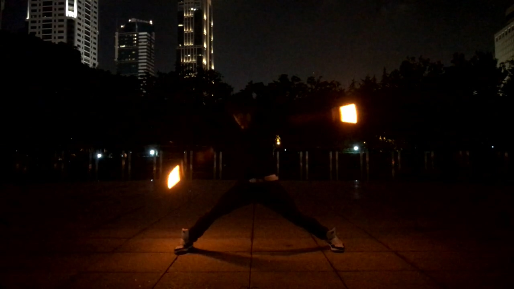

之前总结过一篇关于在Hexo的文章中如何插入图片的文章，这段时间因为整理过去写过的博文，所以重新整理一下上传上来。

<!-- more -->

***

## 1. 配置文件设定

* `post_asset_folder`

    把这一项的值设置为`true`

## 2. 安装插件

* `hexo-asset-image`

    在站点文件夹的根目录中执行命令`npm install https://github.com/CodeFalling/hexo-asset-image --save`

## 3. 在_post文件夹下创建跟文章名字相同的文件夹

如果是在完成了配置文件设定和插件安装以后使用命令进行文章的新建操作，那么会自动生成和文章名相同的文件夹名

在文件夹中存放相关的资源文件

## 4. 调用

使用Markdown语法``调用

## 测试

