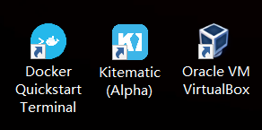

这段时间又是有公司的新项目的提出，又是帮朋友写毕业设计的后台，又是从零开始写自己的毕业设计，真的是忙得不行。

与此同时，也在不断地吸取一些新的技术和思想，虽然有些缓慢，但也算是在不停地更新自己了吧。

虽然有很多比较想学习的新技术想要了解和整理一下，但想要最先整理的果然还是**Docker**！！！今天就在边学边用的情况下记录一下这个过程，方便以后回顾！

<!-- more -->

***

# Docker

没有什么我可以介绍的内容，因为我并没有很了解Docker，作为前端开发者，我在我室友的介绍下有了解过Docker，据说可以很方便的搭建环境运行应用，不需要去考虑本机上面的诸多限制，我也是因为这一点才想要去用的，至于更多的，边学边用边了解。

## 安装

因为最近在网上找一些应用搭环境预览的时候遇到了MongoDB的版本问题，本机是4.x的版本，而那个应用需要的版本是3.x，这个时候就很郁闷了，像Node的版本通过nvm就已经能够解决了，但是MongoDB我还真没什么办法。

也没有想着去找MongoDB版本不匹配的解决方法，直接想到使用Docker解决，很久以前有想要尝试一下Docker来解决这类型的问题，但以前卡在安装这一步没有成功，而且自己又懒，就没有坚持下去了。

现在技术知识的储备比以前多了一些，而且时机又恰到好处，我觉得现在可以真正去尝试一下了。

* Docker for Windows

  Windows10安装Docker for Windows就好了，不过我电脑在安装的时候失败了，原因是因为我的Windows10是家庭版，无法通过这种方式安装，只能通过Docker Tollbox on Windows来安装。

* Docker Toolbox on Windows

  通过安装Docker Toolbox on Windows的方法，我的电脑上成功安装了Docker，桌面上会出现三个图标。

  

  在第一次使用Docker的时候遇到过一个问题，是在打开了`Docker Quickstart Terminal`之后，命令行卡死在下载`boot2docker.iso`这个文件上，其实解决方法很简单，只要把命令行里面的那个下载地址复制出来单独下载好，把下载好的文件放到相应的文件夹里就好了，我本机的路径是`C:\Users\15817\.docker\machine\cache`，可以用作参考。

  我那个时候没找到解决方法我都觉得自己很弱智。。。总而言之，现在就可以愉快的开始探索Docker了。

## 尝试

参考了阮一峰写的文章进行了实践，底下是一些命令的实践和总结。

* `docker version`

  查看Docker的版本

* `docker info`

  查看Docker的信息

* `docker container run hello-world`

  依据hello-world的镜像，生成一个hello-world的容器 

* `docker images`|`docker image ls`

  查看本地镜像

* `docker container ls`

  查看本地正在运行的容器

  * `docker container ls --all`

    查看本地所有的容器

* `docker container rm xxxxxxxxxxxx`

    删除id为xxxxxxxxxxxx的容器

* `docker image rm hello-world`

  删除本地名为`hello-world`的镜像

* `docker image pull node:8.4`

  下载标签为8.4的node镜像至本地

* `docker rm $(docker ps -aq)`

  删除所有的容器

* `Dockerfile`

  ```dockerfile
  FROM node:8.4
  COPY . /app
  WORKDIR /app
  RUN ["npm", "install"]
  EXPOSE 3000
  ```

* `docker image build -t koa-demo .`

  根据当前路径的`Dockerfile`文件生成名为`koa-demo`的本地镜像

* `docker container start xxxxxxxxxxxx`

  运行id为xxxxxxxxxxxx的容器

* `docker container kill xxxxxxxxxxxx`

  停止id为xxxxxxxxxxxx的后台容器的运作

* `docker search nginx`

  查找远程库中的nginx镜像

* `docker pull php`

  拉取远程库中的php镜像到本地

* Docker在Windows下的端口映射问题
  
  `docker-machine ip default`

***

更新中