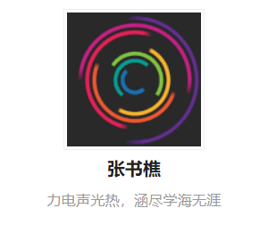

<!-- more -->

***

在自己的亲友群讨论[vtuber](https://zh.moegirl.org/%E8%99%9A%E6%8B%9FUP%E4%B8%BB)的时候谈论到了[live2d](https://zh.moegirl.org/Live2D)的技术，去年夏天的时候就想要给自己的hexo博客用上live2d的看板娘，但是直到现在仍然没有实现。

抱着一些尝试和探索的心态，我打开Chrome，在百度中搜索了live2d这个词条，载入后的页面里，前几个词条上除了live2d的百度百科和一些不明来路的官方网址以外，让我比较在意的是CSDN的一个文章《[live2d看板娘一览图](https://blog.csdn.net/u012931864/article/details/83054822)》。

这个文章本身并没有什么吸引我的内容，我迅速地刷到页面的下方后，在推荐文章中看到了一篇比较吸引我的文章，我像往常一样，不顾Chrome顶部标签页的拥挤，为它们增加了一名新的成员，却没想到，这个超链接会带我“接触”到两个优秀的人。

为了纪念一下（x，把这个文章放在这里吧。

[hexo中next主题添加里lived看板娘（会说话，会换装）](https://blog.csdn.net/dataiyangu/article/details/83021854)

## 1

因为我本身就阅览过一些关于在Hexo当中如何插入live2d看板娘的文章，所以点进这篇文章的原因并不是出于学习的心态，而单纯的是自己的一种习惯：**看到了觉得可能有价值的链接就点**。

而进入到这篇文章之后我也是秉承着**看到了觉得可能有价值的链接就点**的原则，点进了一个[个人博客](https://zhangshuqiao.org/)中，而这个博客的价值，让我再一次巩固了**看到了觉得可能有价值的链接就点**的这一个想法，虽然最好**不要在Chrome的标签栏上一次性打开太多标签**。

进入这个博客，引入眼帘的就是熟悉的Next主题风格、熟悉的live2d角色，但同时令我熟悉的还有背景的内容，这个点一下就会切换样式的背景是[DIYgod](https://diygod.me/)博客也在用的背景风格，这一下就把我对这个博主的亲密感拉高了不少，但想想会用live2d做看板娘的博主除了那些对新奇技术感兴趣的geek以外，大概也就是一些热爱ACG文化的开发者了。

简单的浏览了一下他写的关于live2d的文章之后转入了他的首页，发现他做的内容还挺广，看样子是一个全栈工程师，近来看到的全栈工程师越来越多，也逐渐的让我对全栈充满了向往，偶尔还在想自己是不是也有那个器量能够做到，但就效率低下的现在来说，这个暂时也只能是做梦吧。

意外的是，除了技术文章外，他还写了不少个人生活相关的内容，这让我感到有些舒适。因为自己最近才把个人博客和技术博客合并，虽然之前也见过不少人把技术内容和个人内容写在一起，但在合并博客内容之后，这还是第一次见到别的博主把个人内容和技术内容写在一起，这也让我更加的坚信，做博客是自己的事情，写什么东西都是自己决定的。

看着累计有109篇的博文数量，还有个性化的Next皮肤，就想到自己还有那么多没做好的事情，那么多没能坚持下去的事情，那么多想做却没有做的事情。但同时也找到了自己提升的空间，想到能在109篇文章中找寻对我来说有价值的内容，想到接触到这么一个优秀的博主，我就感到兴奋。

但在浏览这个博客的时候，我应该还不知道，我竟然还能发现另外一个优秀的博主。

## 2

在这个博客呆了一会儿之后，我回退到之前点进来的文章。CSDN社区在我的印象中，一直都是复制粘贴的文章居多，但没想到在随意的点击下竟然能找到这个原创文章。果然在互联网上，点击超链接的行为就跟淘宝一样，因为你可能不知道某个连接之后等待的你到底是怎么样的宝藏，当然也有可能只是一堆垃圾。

因为对这篇原创文章的作者感到好奇，我点进了[这个作者的个人空间](https://blog.csdn.net/dataiyangu)，没想到他写的一些文章和转载的一些文章竟然包含有自律的内容，而且我最近正好在做自律这件事情！除此之外，令我意外的还有，他的一篇转载文章《[TED | 为什么在舒适圈待久了会毁了你](https://blog.csdn.net/dataiyangu/article/details/100760484)》正好是之前我在B站看过并且mark了的TED演讲！

在短暂的意外和惊喜之后，我点进了他的一些关于自律的原创文章，简单的感想就是：“**我真是太幸运了**”。能在今天碰到一个思考方向与我类似，并且比我优秀的博主，是多么幸运的事情。但意外的是，我再次回到那个讲述live2d的文章中，仔细查看文章内容的时候，我发现，刚才点进去的[个人博客](https://zhangshuqiao.org/)并非是这个CSDN作者的博客，而这个[CSDN作者的自己的博客](https://mmmmmm.me/)，也贴在了这篇文章中。

太意外了，在一个下午，通过几个超链接，我就找到了两个优秀的人，这是多么难得的事情。我收藏了这两个博客之后，稍微放空了一下自己，心里除了幸运的喜悦之外，还有各种各样无法用我的字典中找到形容的感触。但有一句从那位CSDN博主的原创文章中看到的话我想把记下来，实在是太有味道了。

> 多认识更加优秀的人，你会讨厌现在的自己。

变得更“讨厌”自己吧，我能变得更好。

## 3

在感叹之余，还有一些技术上的事情想要记下来。

之前发现的两个博主都是用hexo做的个人博客，同时博客做的都很精细，这让我想到我自己的hexo博客做了这么久，因为各种各样的事情总是把一些自己感兴趣的东西放着不做，结果到最后就忘掉，搁置下来，真的非常遗憾。在看了这两个博主的博客和一些文章之后，我也重新燃起了一些热情，希望能够把自己的博客做的更好一点。

自己大三的时候也曾给Hexo做过一个主题，现在也想拿出来把改进改进，开源一下，因为自己一直都没有做过什么有价值的开源项目，所以对这个还感到有些小兴奋！

还有在搜索live2d的时候发现了live2d制作工具[Live2D Cubism的官网](https://www.live2d.com/zh-CHS/)，因此脑子里面也冒出了整一整Live2D的想法，毕竟自己还有给自己Hexo整一个Live2D看板娘的想法，深入整一整也不是不可以。

***

能够碰到比自己优秀的人是真的很有意义的事情，我觉得跟比自己优秀的人基本上都有一层“墙壁”，这个墙壁是不可见的，但就因为这层墙壁，你没有办法碰到更加优秀的人，但偶尔有这种机会，如果你意识到了，就一定要抓住不要放手。

关于优秀的这个话题，我想我还有很多东西想要说，就放到以后专门写一点内容来做总结吧。。。
