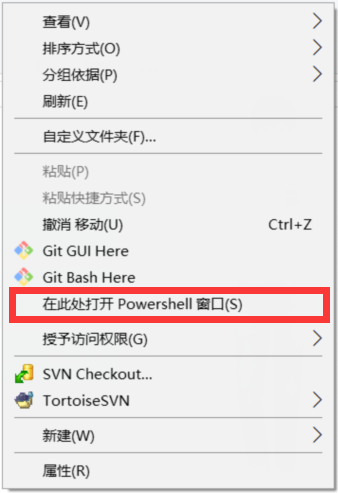
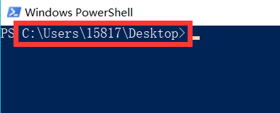
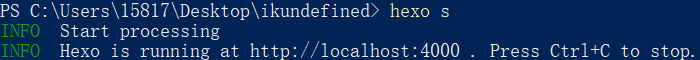
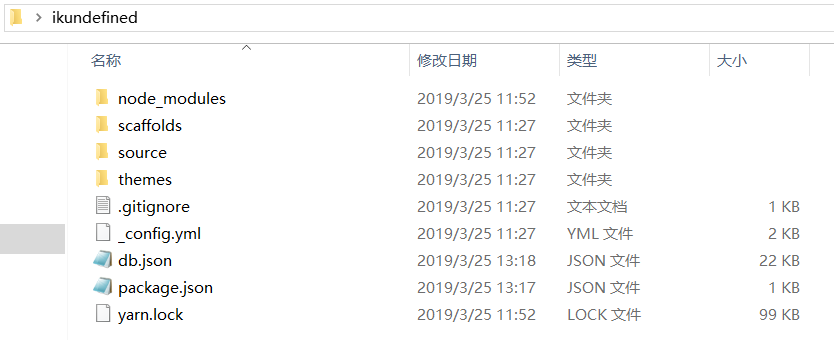

距我刚开始接触Hexo到现在大概有2年多的时间了，为了复习一下用Hexo搭建个人博客的流程，大概在前两天，我找到我的一个朋友，硬是要给她用Hexo搭建一个博客。除了基本的介绍和每个操作的要点解释之外，基本上只花了1个小时多的时间来完成，当然，这是把下载时间也给算上了的。

在网络状况良好的情况下，正常流程下来大概30多分钟就可以完成博客的搭建了。这一篇文章就给大家介绍一下在**Windows**操作系统下如何使用**Hexo+Github**，**免费**而又**快速**的搭建好自己的**个人博客**！

<!-- more -->

---

> 如果你并非编程爱好者或专业开发人员，那你可以忽略一些对于专业名词的具体介绍，只专注于步骤。

## Hexo简介

Hexo是一个可以快速构建起个人博客的工具，用官网的介绍来说就是

> 快速、简洁且高效的博客框架

我的这个个人博客就是使用`Hexo`搭建的，主题使用的是`Next`。Hexo拥有很多美观的博客主题，在这篇文章的最后，我会给大家介绍一些我觉得不错的。

## 环境搭建

在搭建环境这一步，我们需要安装必不可缺的一些工具。

### Node.js

  [中文官网下载](http://nodejs.cn/download/)

  > 安装Node.js是为了Node.js附带的npm，Hexo是npm上的一个博客构建工具，所以要通过npm命令进行下载，因此需要安装Node.js

### Hexo

  ```bash
  npm install hexo-cli -g
  ```

  <span style="color: #6cf;">tip:</span> 该命令需要通过**命令行工具**执行。

  > `hexo-cli`通过`npm`进行下载，如上所说，Hexo是npm上的一个博客构建工具，所以要通过npm的命令进行安装。

  > 我们使用Hexo的操作基本上都是通过命令进行的，因此我们需要下载Hexo的命令行工具，即`hexo-cli`，为的是可以在命令行中使用`hexo`命令进行相关操作。

### Git

  [官网下载](https://www.git-scm.com/download/)

  > Git是现在最为流行的**版本控制系统**，我们在站点的搭建过程中会通过Git来部署我们的站点，更新内容到**Github**的服务器上。

## 站点构建

### 站点初始化

  通过`hexo init`命令我们快速初始化站点文件夹
  
  <span style="color: #6cf;">tip:</span> 我们可以在想要建立站点文件夹的文件夹的空白处按住`shift`后单击鼠标右键，在快捷菜单中选择在此处打开命令行工具，win10中显示的应该是`在此处打开Powershell`，打开之后，我们会看到路径就是在当前文件夹下，我们可以通过`hexo init 文件夹名`来新建。

  

  

  或者，我们在文件夹中新建好空的站点文件夹，进入到这个空的站点文件夹在空白处按住`shift`后单击鼠标右键，在快捷菜单中选择打开命令行工具的选项然后进入命令行工具直接输入`hexo init`在该文件夹中初始化博客站点。

### 博客预览

  在站点文件夹的位置中打开命令行工具，通过`hexo s`命令，片刻后，我们可以在默认的[localhost:4000](localhost:4000)中看到Hexo初始化生成的博客，一般来说主题是默认的`landscape`，全英文界面，还有一篇实例文章**Hello World**。

  

### 站点文件夹构成

  

  * `source`

    `source`文件夹中的`_posts`文件夹是存放博文的地方，最开始我们可以看到有一个后缀名为`.md`的文件在里面，`.md`是使用`Markdown`撰写的文档格式，学习起来非常简单，不用担心，熟练用起来之后相信你也会喜欢上。

  * `themes`

    `themes`是存放Hexo主题的文件夹，Hexo默认的主题是`landscape`，如果觉得不好看可以自己找一些主题替换，关于如何搜索主题、更换主题和主题的一些配置在以后我也会更新文章为大家说明，文章最后也会介绍一些我觉得不错的主题给大家。

  * `_config.yml`

    `_config.yml`文件是Hexo的核心配置，配置也是Hexo中非常重要的部分，我将在配置博客中详细说明。

## 博客配置

`_config.yml`中有一些比较重要的配置项，在这里我给大家例举出来解释一下，其他的配置项基本可以以此类推知道大概作用。

```yml
# Site
title: 网站标题
subtitle: 网站副标题
author: 网站作者
language: 网站语言

# Extensions
theme: 博客主题

# Deployment
deploy: 部署配置
```

> 需要注意的是，配置完`_config.yml`文件之后，需要重启`hexo`服务，否则配置不会生效。

## 部署站点

### 开启服务

* 新建仓库

  假设你已经有了Github账号，接下来你需要新建仓库，在新建仓库的时候，仓库的命名方式为`yourgithubaccount.github.io`，也就是命名的最开头是你的Github账号，以这样方式命名的仓库会开通Github Pages服务，到时候我们只需要将我们的静态文件部署到这个仓库中就可以了。

  > Github Pages服务可以通过特定的`url`来进行访问，把静态文件放在开通了Github Pages服务的仓库中就可以在特定的`url`上访问你的网页。

### 上传Github

* 配置git

  * git config --global user.name
  * git config --global user.email

* 安装部署插件

  `npm i hexo-deployer-git -S`

* 配置`_config.yml`文件

  * deploy

    * type: git

    * repo: https://github.com/yourname/yourname.github.io.git

* 部署站点

  `hexo d -g`或者`hexo g -d`

## 文章撰写

`Hexo`是用`Markdown`来写文章的，`Markdown`是一种非常简单的标记语言，这里来介绍一下常用的Markdown语法，非常简单，5分钟之内就可以学会。

* 标题 #

  标题使用`# 标题内容`来表示，`#`的数量代表标题的大小，一个`#`是一级标题，最大，`##`是二级标题，以此类推，`#####`是六级标题，最小。

* 无序列表 *

  无序列表通过`* 列表项`来表示，可以嵌套，以显示不同样式的列表项标识。

* 有序列表 1.

  有序列表通过`n. 列表项`的方式来表示。

* 引用 >

  以`> 引用内容`的方式引用别处出现过的内容。

* 行内代码 `

  一行以内的代码可以用这样的方式表示。

* 代码块 ```

  一行以上的代码块可以用这样的方式表示。

* 粗体 **

  用`**需要粗体表示的内容**`的方式来表示粗体文本。

* 斜体 *

  用`*需要斜体表示的内容*`的方式表示斜体文本。

* 超链接 []()

  用`[超链接](链接地址)`的方式表示超链接。

## 主题分享

* [Next](https://github.com/theme-next/hexo-theme-next)

* [Art Design](https://github.com/dongyuanxin/theme-ad)

* [Ocean](https://github.com/zhwangart/hexo-theme-ocean)

* [MoeIcarus](https://github.com/MoeFE/Hexo-Theme-MoeIcarus)

* [Cube](https://github.com/ZEROKISEKI/hexo-theme-cube)

* [Yilia](https://github.com/litten/hexo-theme-yilia)

---

其实很多东西都可以自己去探索探索，安利一个[Hexo的Awesome List](https://github.com/hexojs/awesome-hexo)，方便大家开阔属于自己的Hexo个人博客。

对了，还有[Hexo的官网](https://hexo.io/zh-cn/)，没事去官网看看是一个不错的习惯，对于什么技术来说都是这样。