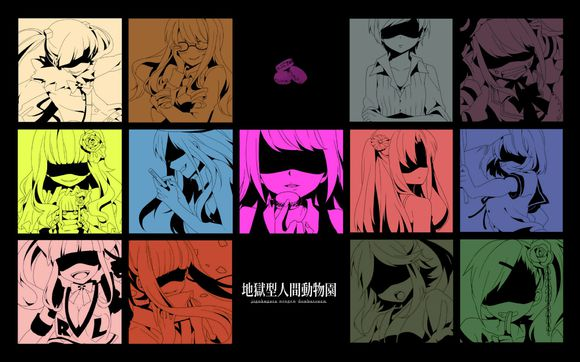

**在这个世界上，我们只能做我们自己。**

<!-- more -->

---

初冬，天亮的很晚，但快要亮了。片刻之前，在V2EX社区中读了一篇标题为《[发现自己渐渐丧失了主动社交的能力了](https://www.v2ex.com/t/624901#reply1)》的帖子。在刚刚关闭的QQ空间中又看到了不少多愁善感的文字、对现状的抱怨还有一些转发的网络资讯。

## 百感交集

深夜总会有一种冲动，想要向世界宣泄自己内心的苦闷；想要让世界明白一点自己的所思所想所处境遇；想要让世界与自己感同身受。但我现在深知，这种事情是无法做到的，想要去做这种无法完成的事情的人，实在是愚蠢。

不过，擅自评判他人的行为又有什么高明呢？只是觉得，想要对世界诉说自己内心痛苦的自己实在愚蠢。只不过，意识到这样的行为是徒劳所以没有去做的我，稍微也比曾经成长了一些吧。终究所思所想不能改变世界，只有行动会留下痕迹。

但看到他人所诉说痛苦之时，的确也能激起自己的同情、同理。但终究只是心里共感了，并不会做出行动，因为我知道，在有些人的生命中，我不会成为关键的那部分，伸出“救援之手”之后，我能为之后的连锁作出反应嘛，我大概没有那么多精力，仅仅为了一个喜欢的人，我都已经手无足措了。即使如此，我依然会惋惜，如果对别人伸出了手，是不是也能让别人获得一些救赎感呢？

我没有伸出手，因为我心里有一个结论：**真正救自己的人，一定只能是自己**。但，当别人对我伸出援手的时候，我还是很感谢，感谢他们愿意在生命的光盘上刻录下我所存在过的痕迹。我知道

> 当我们把时间花到一个人身上的时候，相当于在他身上倾注了自己生命的一段——不管最终的结果如何，那个人和那件事都已经成为我们生命中的一部分。

刚看到空间的一些抱怨的时候，心里只是抱着“看戏”的态度。我没有办法去帮别人做什么，同时也觉得，就算有谁去帮了，也不会真正的解决问题，因为下次这个人可能还会因为别的事情陷入同样的僵局。实际上，对于这个人出现的问题，可能不是第一次看到了。看起来是针对这个人有什么意见，其实不是，只是对于遇到困难如何去解决，我认为一定会有更好的方法的，如果对这个人而言，发说说是一种散发情绪的手段，那我觉得，这个人做的还是不错的。因为我曾经也通过这种手段让自己心里好过不少。

## 地狱型人间动物园

其实看戏这个词有一些贬义了，我只是旁观者而已，我现在更愿意把这叫做观察，从这些观察到的内容里面思考，寻找一些表面之下的存在。也就是在逛QQ空间的时候，想到了一个词：**人间动物园**。这个词是我在一个专辑名里面看到的，那张专辑叫做《[地狱型人间动物园](https://music.163.com/#/album?id=2700533)》，里面比较有人气的曲子就是《[脑浆炸裂女孩](https://music.163.com/#/song?id=27958144)》了。

人间动物园这个组合搭配已经完全把我想要说的话给概括进去了，但可能每个人的理解都会不同吧，这不就反过来体现了人间动物园的这个词么，形形色色，每个人都是不同的个体，实在有趣。而夜色下的SNS网络也就是地狱型人间动物园，充斥着呻吟自我痛苦的声音，但又无法相互理解，自顾自地，哭泣、低语、大叫。。。

在百度地狱型人间动物园但时候，进到了这张专辑但词条，翻看了这张专辑里面一些曲子的说明，竟然发现有一首听了很多遍的曲子包含了一些自己意想不到，但看了之后豁然开朗的释义。

## 颜本耽溺女孩

> FACEBOOK中毒。沉浸在收集“赞！”的快感中的少女。

我还真没有注意到“颜本”是Facebook的意思，虽然要是仔细去看的确就能发现。这首歌我之所以经常听是因为节奏很适合打艺，至少我喜欢用这首歌去打艺。不过，我却从来没有注意过这首歌的歌词。

> “颜本”指FaceBook
> 颜本耽溺换成我们听得懂的就是所谓的“微博控”
> 就是吃个晚饭都要拍下来加TAG发出去，看看会有多少赞多少评论
> 这样看上去貌似很有优越感，其实只是一种对自己的自我催眠罢了
> 就像歌词里说的，谁会注意手机屏幕背后的你呢？
> **你只是沉醉于赞美沉醉与卑微友情的渺小生物罢了**
> 如果说电脑狂爱是主动跳入网络这个电波地狱，那颜本沉溺就是慢慢被电波地狱给淹没。

在百度上看到这样引我深思的话还真的是很意外，但与其说是意外不如说是幸运吧。正因为逛QQ空间有感才想到人间动物园这个词，然后去百度搜索人间动物园找到了以前关注过的地狱型人间动物园这个专辑的百科词条，再到在这个专辑的歌曲介绍中看到这首歌，最后点进这首歌的专题页面中看到这段释义。只能用水到渠成这个词来形容了。

---

> 谁会注意手机屏幕背后的你呢？**你只是沉醉于赞美沉醉与卑微友情的渺小生物罢了**。

希望你不要被电波地狱给淹没。因为，在这个世界上，我们只能做我们自己。
