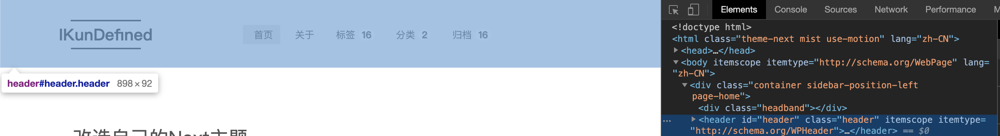
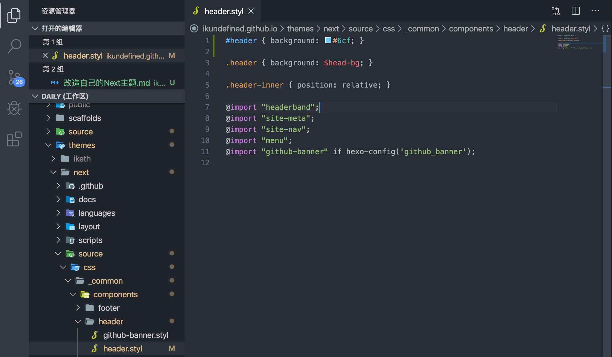
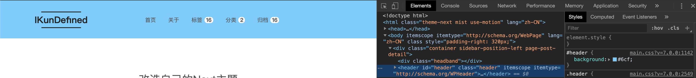
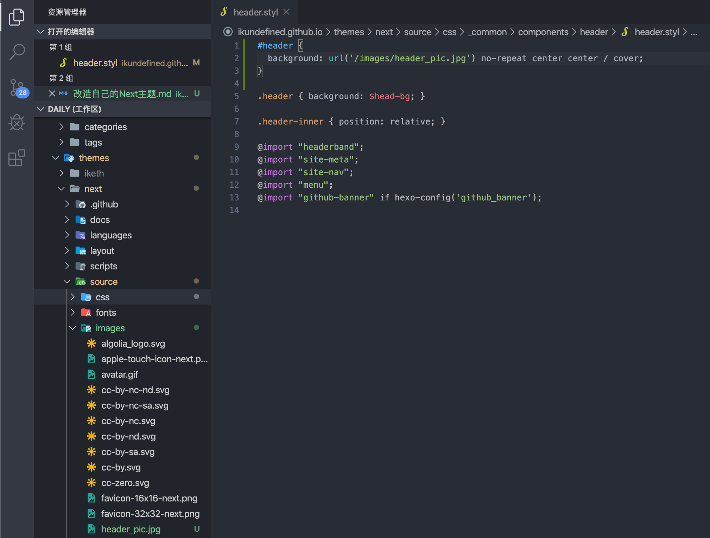
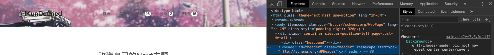
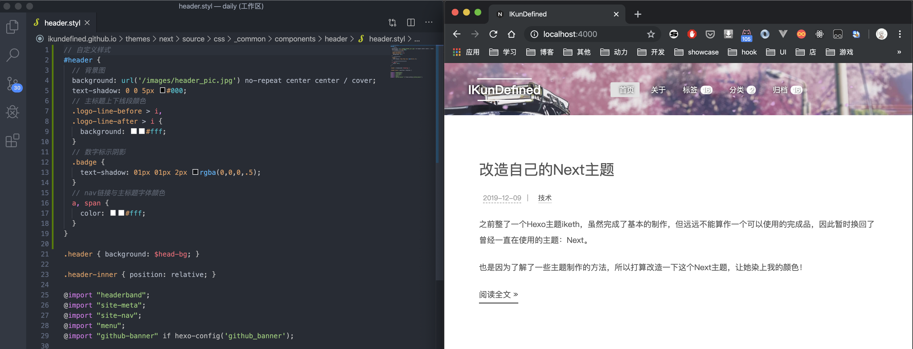

之前整了一个Hexo主题iketh，虽然完成了基本的制作，但远远不能算作一个可以使用的完成品，因此暂时换回了曾经一直在使用的主题：Next。

也是因为了解了一些主题制作的方法，所以打算改造一下这个Next主题，让她染上我的颜色！

<!-- more -->

---

## 头部背景

之前在别的使用了Next主题的博客里面看到了把头部背景的纯色改成了背景图的情况，这让我非常心动，所以第一步打算改一下头部背景图。

打开本地运行环境之后，先在Chrome Dev Tools中的Elements中找到需要添加背景图的元素。

该元素id和class均为header，在next主题文件中找到头部所引用的`.styl`文件。使用`#header`对元素进行样式修改，查看效果，看是否可行。

通过测试，发现这种方法可行。接下来把要用的图放到主题文件夹下的`source/images`文件夹中，接着在background属性中调用，使用cover属性值让背景图适应宽度。

从观赏效果来看，背景看起来还可以，但是文字看不清，所以我决定字体颜色采用白色，并且加上阴影效果。

