前两天看到别的博主对自己的Hexo博客进行优化的成果，自己心动万分。但由于过于懒惰，搞得自己总是在博客个性化的这条路上磕磕绊绊。

于是乎，在昨天晚上，我终于下定决心，打算把自己在大三的时候做的Hexo博客主题拿出来重造一下，做一个属于自己的Hexo博客主题！

<!-- more -->

***

早在一开始接触Hexo博客的时候，我就有定制自己博客主题的想法了，实际上那个时候也做了自己的博客主题，但是由于技术与审美上的不足，导致整个博客主题做的没能够达到自己想要的水平，就一直是处于放置play的状态。

但昨天把这个主题拿出来给朋友看的时候，却得到了一定的肯定，我就重新燃起了把这个主题拿出来重做一下的激情。

不过仔细的翻了一下主题的源码文件之后，我发现代码的书写风格还有一些格式的命名都跟我现在的习惯差距太大，而且文件分类的结构也有点问题，所以思考了片刻之后，还是打算重构一下这个主题，与此同时记录一下这个过程！

想想还是有点激动人心！那么就开始整起来！

## 准备工作

主要的开发过程参考[官方文档](https://hexo.io/zh-cn/docs/themes)。

首先，Hexo的主题需要放到Hexo文件夹中的themes文件夹中。

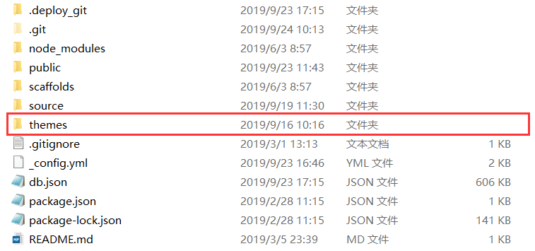

进入到themes文件夹中后，直接创建以博客主题名称命名的文件夹就可以开始接下来的步骤了。

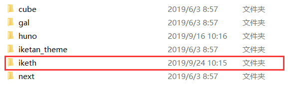

在主题文件夹中创建好`layout`文件夹和`source`文件夹，我们就可以直接开始撸代码了，一开始不用像官方文档中写的那样把文件夹创建的那么齐全，我们按照自己的需要一步步的来走就好了。或者反过来像官方文档上写的那样把需要的文件和文件夹一次性全部创建好，也是一种方法。

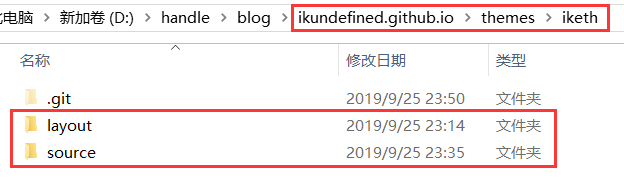

经过上面的流程之后，在Hexo根目录下的_config.yml中把theme配置项改成主题就iketh就可以在本地服务器上看到博客开发的进度了。

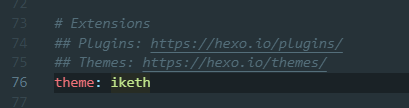

当然现在的状态下肯定是空白页面，也就是从这一步开始，我们要逐渐的把自己的页面给构建起来。

## 页面移植

当我们修改好主题配置项然后启动本地服务去刷新页面的时候，页面虽然是空白，但不会报错，在终端上，我们可以看到提示`No layout: index.html`，那么通过这个提示，我们就知道，我们是缺少了`index`的这个页面。

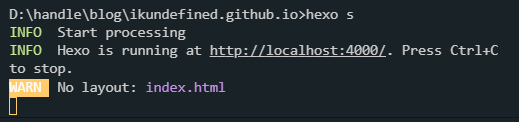

先别急着莽撸代码，我们先确定一下，我们需要做哪些页面。

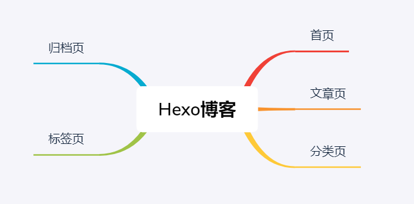

参考了常见的博客主题所拥有的页面以及自己以前制作的博客所有的界面，我大致把页面分为`首页`、`文章页`、`分类页`、`标签页`和`归档页`。明确了要做哪些页面，我们就可以开始动手了，那么最开始肯定是先解决首页部分的制作了。

### 首页

在主题文件夹根目录的layout文件夹中创建index.ejs模板文件，我在这里选用了的模板引擎是[EJS](https://ejs.bootcss.com/)。

在创建好了的index.ejs中，先写一些基本的代码，看看在页面上能否显示出来。

```html
<!DOCTYPE html>
<html>
  <head>
    <meta charset="utf-8">
    <title>首页</title>
  </head>
  <body>
    <div>首页</div>
  </body>
</html>
```

显示的页面是这样的。

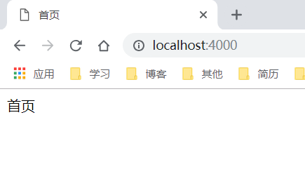

既然能够显示出来，那就可以正式开始撸代码了！首先我们需要清空样式，这里使用一下现成比较完善的样式清空库[Normalize.css](http://necolas.github.io/normalize.css/)。在官网把代码都给下载下来之后，在`source`文件夹中创建`css`文件夹，把`normalize.css`放在这个文件夹中。以后css样式文件的存放都是在这里。而在模板文件中的调用也很简单，直接用相对路径`/`。

```html
<link rel="stylesheet" href="/css/normalize.css">
```

这之后需要调用图片、js文件或者其他资源文件的话，都用这种方式就好。

考虑到是本来就有源码，同时只是做一些样式和结构上的重构，所以可以复用的地方还是接着复用。

在Hexo的主题中，使用ejs编写代码的时候我们可以把页面重复的地方单独封装起来调用。所以我们明确一下页面相同的部分，把代码单独写在独立的ejs文件中进行调用就可以了。

* header - 页面顶部

  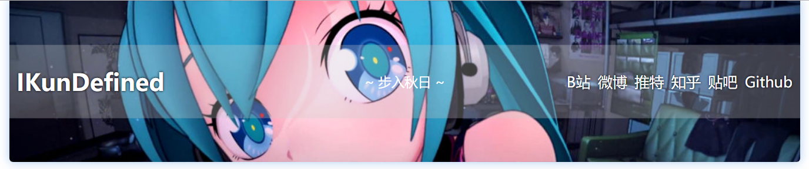

* nav - 导航栏部分

  

* footer - 页面底部

  

* paginator - 分页跳转部分

  

在`layout`文件夹底下新建`_partial`文件夹，用来存放需要被调用的文件。

  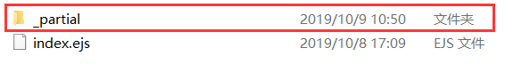

分别创建`header.ejs`、`nav.ejs`、`footer.ejs`和`paginator.ejs`将代码转移过来。

  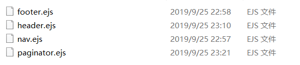

之前在`layout`文件夹底下创建了`index.ejs`文件，Hexo为我们提供了`layout.ejs`，用来把页面相同的地方给引入进去，同时通过简单的方法可以直接调用主体页面的部分，例如首页（index.ejs）、文章页（post.ejs）和归档页（archive.ejs）等。

我们只需要直接在`layout`文件夹下创建`layout.ejs`并且在里面调用代码就好了。

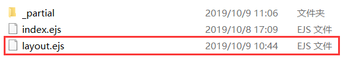

```ejs
<!DOCTYPE html>
<html>
  <head>
    <meta charset="utf-8">
    <title>页面标题</title>
    <!-- 基础样式 -->
    <link rel="stylesheet" href="/css/normalize.css">
  </head>
  <body>
    <%- partial('_partial/header') %>
    <%- partial('_partial/nav') %>
    <%- body %>
    <%- partial('_partial/footer') %>
    <script src="/js/nav-scroll.js"></script>
  </body>
</html>
```

通过上面的代码，我们可以了解到在Hexo中为我们提供了一些可以直接调用的方法，例如局部模板的调用方法`partial`，还有在`layout.ejs`中可以通过`<%- body %>`来调用主要页面的内容，这样我们也好吧`index`、`post`和`archive`等页面的主要代码拆开来写。

接下来把以前写好的`index.ejs`中的主体部分迁移到`iketh`主题的`index.ejs`中，再通过`layout.ejs`中的`<%- body %>`来调用就好了。

### 文章页与归档页

文章页与归档页的移植也是相同的方法，在`layout`文件夹下创建`post.ejs`和`archive.ejs`，然后把先前的代码转移过来。

有点要注意的是，我在设计归档页面的时候是把**标签**归档、**分类**归档以及**时间**归档，这三个部分是分不同类型设计的，所以说在`archive.ejs`中要通过Hexo提供的`is_category()`、`is_tag()`和`is_archive()`来判断。

## 静态资源转移

与页面移植是同时做的事情，只不过写在后面。

这个内容要做的就是把之前主题的`source`文件夹中的静态文件全部转移到`iketh`主题中的`source`文件夹中，实际上在做首页那一步操作的时候，为了做清除样式，我已经在`source`文件夹中创建了`css`文件夹，并且使用了`Normalize.css`这个清除样式库。

## 收尾

基本上做完移植工作之后，关于这个主题的重构就应该先告一个段落了。

这一部分没有修改多少代码，不过我还是做了一部分样式上的修改，至少让整体看起来比较清爽了，不像以前那么萌二（其实也没啥不好。

* 修改前

  

* 修改后

  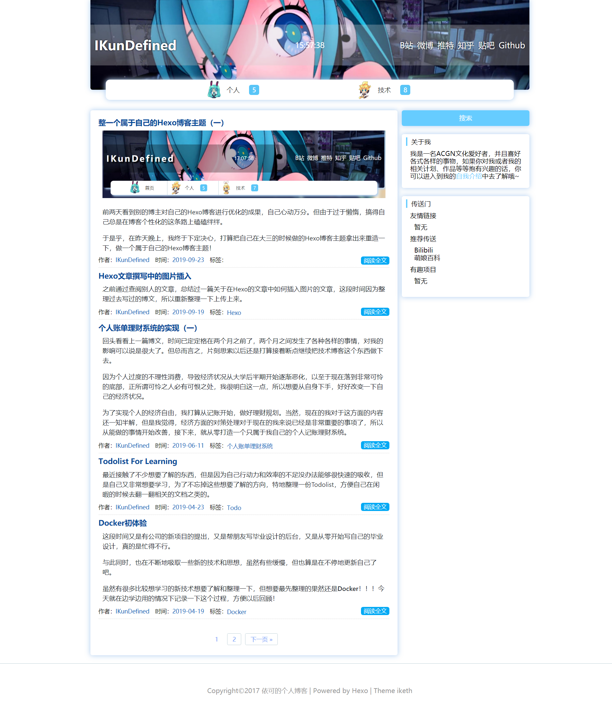

移植代码主要还是为了让我重新读一读代码，看看Hexo的主题大概要怎么做，从现在移植完后的角度来看，之前做的移植工作还是很有意义的，现在让我从零开始写，我也会有点头绪了。

同时在移植的过程中也思考了有没有更好的文件架构，还有一些关于代码的命名之类的，不过这些都不太着急，放到之后的阶段里面做改进也OK。

---

现在也把这个主题放到github上了，不过一个README都还没有（笑，希望能做到有人喜欢并且实际在用的程度吧~

[39](https://github.com/IKunDefined/hexo-theme-iketh/releases/tag/v1.0.0)