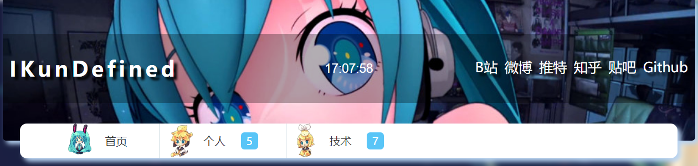

前两天看到别的博主对自己的Hexo博客进行优化的成果，自己心动万分。但由于过于懒惰，搞得自己总是在博客个性化的这条路上磕磕绊绊。

于是乎，在昨天晚上，我终于下定决心，打算把自己在大三的时候做的Hexo博客主题拿出来重造一下，做一个属于自己的Hexo博客主题！

<!-- more -->

***

早在一开始接触Hexo博客的时候，我就有定制自己博客主题的想法了，实际上那个时候也做了自己的博客主题，但是由于技术与审美上的不足，导致整个博客主题做的没能够达到自己想要的水平，就一直是处于放置play的状态。

但昨天把这个主题拿出来给朋友看的时候，却得到了一定的肯定，我就重新燃起了把这个主题拿出来重做一下的激情。

不过仔细的翻了一下主题的源码文件之后，我发现代码的书写风格还有一些格式的命名都跟我现在的习惯差距太大，而且文件分类的结构也有点问题，所以思考了片刻之后，还是打算重构一下这个主题，与此同时记录一下这个过程！

想想还是有点激动人心！那么就开始整起来！

## 准备工作

主要的开发过程参考[官方文档](https://hexo.io/zh-cn/docs/themes)。

首先Hexo主题需要放到Hexo文件夹中的themes文件夹中，直接创建以博客主题名称命名的文件夹就好了。

在主题文件夹中创建好`layout`文件夹和`source`文件夹，我们就可以直接开始撸代码了，一开始不用像官方文档中写的那样把文件夹创建的那么齐全，我们按照自己的需要一步步的来走就好了。或者反过来像官方文档上写的那样把需要的文件和文件夹一次性全部创建好，也是一种方法。

经过上面的流程之后，在Hexo根目录下的_config.yml中把theme配置项改成主题就iketh就可以在本地服务器上看到博客开发的进度了。当然现在的状态下肯定是空白页面，也就是从这一步开始，我们要逐渐的把自己的页面给构建起来。

## 页面开发

当我们修改好主题配置项然后启动本地服务去刷新页面的时候，页面虽然是空白，但不会报错，在终端上，我们可以看到提示`No layout: index.html`，那么通过这个提示，我们就知道，我们是缺少了index.html的这个布局文件。先别急着莽撸代码，我们先确定一下，我们需要做哪些页面。

参考了常见的博客主题所拥有的页面以及自己以前制作的博客所有的界面，我大致把页面分为`首页`、`文章页`、`分类页`、`标签页`和`归档页`。明确了要做哪些页面，我们就可以开始动手了，那么最开始肯定是先解决首页部分的制作了。

### 首页

在主题文件夹根目录的layout文件夹中创建index.ejs模板文件，我在这里选用了的模板引擎是ejs。

在创建好了的index.ejs中，先写一些基本的代码，看看在页面上能否显示出来。

```html
<!DOCTYPE html>
<html>
  <head>
    <meta charset="utf-8">
    <title>首页</title>
  </head>
  <body>
    <div>首页</div>
  </body>
</html>
```

既然能够显示出来，那就可以正式开始撸代码了！首先我们需要清空样式，这里使用一下现成比较完善的样式清空库`Normalize`，在官网把代码都给下载下来之后，在`source`文件夹中创建`css`文件夹，把`normalize.css`放在这个文件夹中。以后css样式文件的存放都是在这里。而在模板文件中的调用也很简单，直接用相对路径`/`

